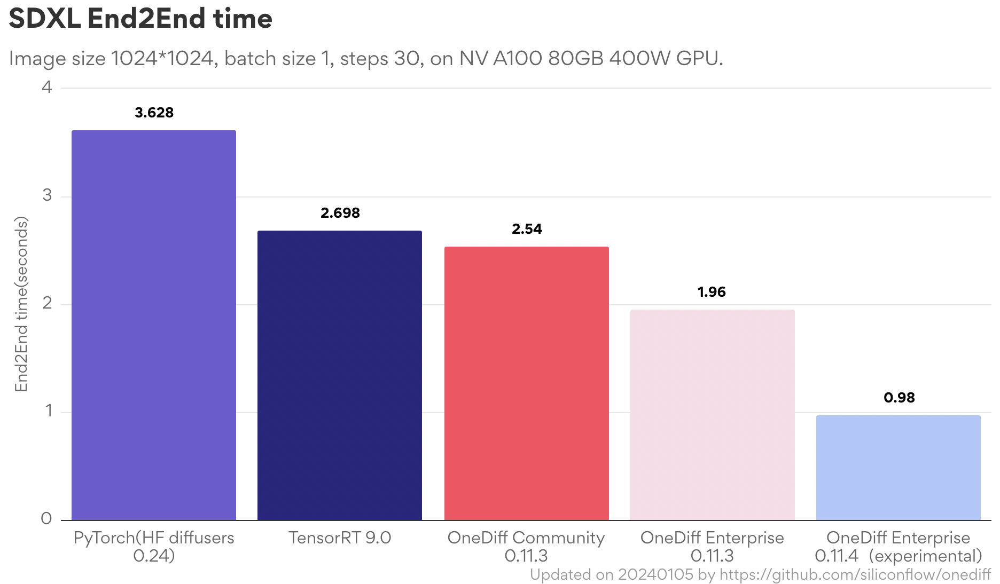

<p align="center">

</p>

---

[](https://github.com/siliconflow/onediff/actions/workflows/sd.yml)
[](https://github.com/siliconflow/onediff/actions/workflows/examples.yml?query=event%3Aschedule)

OneDiff is **an out-of-the-box acceleration library for diffusion models**  (especially for ComfyUI, HF diffusers, and Stable Diffusion web UI).

OneDiff is the abbreviation of "**one** line of code to accelerate **diff**usion models".

## Need help or communicate
- [Create an issue](https://github.com/siliconflow/onediff/issues)
- Chat in Discord: [](https://discord.gg/RKJTjZMcPQ)
- Email for business inquiry: contact@siliconflow.com
- [OneDiff Development Roadmap](https://github.com/siliconflow/onediff/wiki#onediff-roadmap)

## Easy to use
- Out-of-the-box acceleration for popular UIs/libs
  - [ComfyUI](https://github.com/siliconflow/onediff/tree/main/onediff_comfy_nodes)
  - [HF diffusers 🤗](https://github.com/siliconflow/onediff/tree/main/examples)
  - [Stable Diffusion web UI](https://github.com/siliconflow/onediff/tree/main/onediff_sd_webui_extensions)
  - [Acceleration with oneflow_compile](https://github.com/siliconflow/onediff/blob/main/examples/text_to_image_sdxl.py)
- Acceleration for state-of-the-art Models
  - [SDXL](https://github.com/siliconflow/onediff/blob/main/examples/text_to_image_sdxl.py)
  - [SDXL Turbo](https://github.com/siliconflow/onediff/blob/main/examples/text_to_image_sdxl_turbo.py)
  - [SD 1.5/2.1](https://github.com/siliconflow/onediff/blob/main/examples/text_to_image.py)
  - [LoRA (and dynamic switching LoRA)](https://github.com/siliconflow/onediff/blob/main/examples/text_to_image_sdxl_lora.py)
  - [ControlNet](https://github.com/siliconflow/onediff/blob/main/examples/text_to_image_controlnet.py)
  - [LCM](https://github.com/siliconflow/onediff/blob/main/examples/text_to_image_lcm.py) and [LCM LoRA](https://github.com/siliconflow/onediff/blob/main/examples/text_to_image_lcm_lora_sdxl.py)
  - [Stable Video Diffusion](https://github.com/siliconflow/onediff/blob/main/examples/image_to_video.py)
  - [DeepCache](https://github.com/siliconflow/onediff/blob/main/examples/text_to_image_deep_cache_sdxl.py)
- Ready for production
  - [Support Multi-resolution input](https://github.com/siliconflow/onediff/blob/main/examples/text_to_image_sdxl.py)
  - Compile and save the compiled result offline, then load it online for serving
    - [Save and Load the compiled graph](https://github.com/siliconflow/onediff/blob/main/examples/text_to_image_sdxl_save_load.py)
    - [Change device of the compiled graph to do multi-process serving](https://github.com/siliconflow/onediff/blob/main/examples/text_to_image_sdxl_mp_load.py)

## State-of-the-art performance



## OS and GPU support
- Linux
  - If you want to use OneDiff on Windows, please use it under WSL.
- NVIDIA GPUs

## OneDiff Online Playground
[Online Playground](https://github.com/siliconflow/onediff/wiki/OneDiff-Online-Playground)

## OneDiff Enterprise Edition
If you need **Enterprise-level Support** for your system or business, please send an email to contact@siliconflow.com and tell us about your user case, deployment scale, and requirements.

OneDiff Enterprise Edition can be **subscripted for one month and one GPU** and the cost is low: https://siliconflow.com/onediff.html

|                      | OneDiff Enterprise   | OneDiff Community |
| -------------------- | ------------------- | ----------- |
| SD/SDXL series model Optimization| Yes | Yes|
| UNet/VAE/ControlNet Optimization | Yes      | Yes         |
| LoRA(and dynamic switching LoRA)                 | Yes             | Yes         |
| SDXL Turbo/LCM                  | Yes             | Yes         |
| Stable Video Diffusion |  Yes      | Yes |
| HF diffusers            | Yes                 | Yes         |
| ComfyUI              | Yes           | Yes         |
| Stable Diffusion web UI | Yes          | Yes         |
| Multiple Resolutions | Yes(No time cost for most of the cases)       | Yes(No time cost for most of the cases)           |
| More Extreme and Dedicated optimization(usually another 20~100% performance gain)         |   Yes         |                 |
| Technical Support for deployment    | High priority support       | Community           |
| Get the latest technology/feature | Yes | |

## Install from source or Using in Docker
### Install from source

#### 1. Install OneFlow
> **_NOTE:_** We have updated OneFlow a lot for OneDiff, so please install OneFlow by the links below.

- **CUDA 11.8**

  ```bash
  # For NA/EU users
  python3 -m pip install -U --pre oneflow -f https://github.com/siliconflow/oneflow_releases/releases/expanded_assets/community_cu118
  ```


  ```bash
  # For CN users
  python3 -m pip install --pre oneflow -f https://oneflow-pro.oss-cn-beijing.aliyuncs.com/branch/community/cu118
  ```


<details>
<summary> Click to get OneFlow packages for other CUDA versions. </summary>

- **CUDA 12.1**

  ```bash
  # For NA/EU users
  python3 -m pip install -U --pre oneflow -f https://github.com/siliconflow/oneflow_releases/releases/expanded_assets/community_cu121
  ```


  ```bash
  # For CN users
  python3 -m pip install --pre oneflow -f https://oneflow-pro.oss-cn-beijing.aliyuncs.com/branch/community/cu121
  ```


- **CUDA 12.2**

  ```bash
  # For NA/EU users
  python3 -m pip install -U --pre oneflow -f https://github.com/siliconflow/oneflow_releases/releases/expanded_assets/community_cu122
  ```

  ```bash
  # For CN users
  python3 -m pip install --pre oneflow -f https://oneflow-pro.oss-cn-beijing.aliyuncs.com/branch/community/cu122
  ```


</details>


#### 2. Install torch and diffusers
```
python3 -m pip install "torch" "transformers==4.27.1" "diffusers[torch]==0.19.3"
```

#### 3. Install OneDiff
```
git clone https://github.com/siliconflow/onediff.git
cd onediff && python3 -m pip install -e .
```

#### 4. (Optional)Login huggingface-cli

```
python3 -m pip install huggingface_hub
 ~/.local/bin/huggingface-cli login
```

## Release

- run examples to check it works

  ```bash
  python3 examples/text_to_image.py
  python3 examples/text_to_image_dpmsolver.py
  ```

- bump version in these files:

  ```
  setup.py
  src/onediff/__init__.py
  ```

- build wheel

  ```
  rm -rf dist
  python3 setup.py bdist_wheel
  ```

- upload to pypi

  ```bash
  twine upload dist/*
  ```
