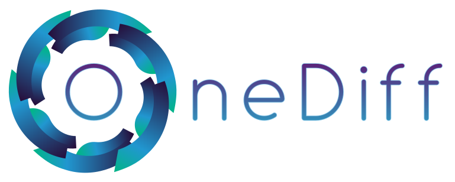
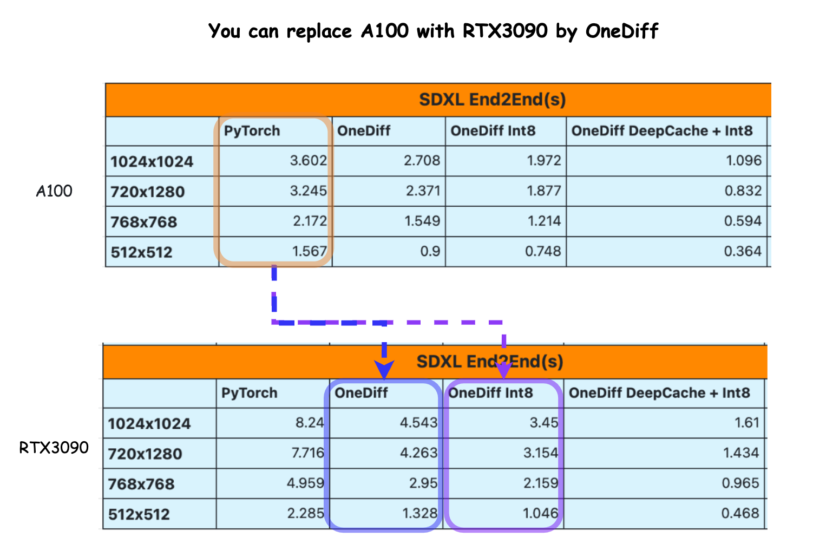
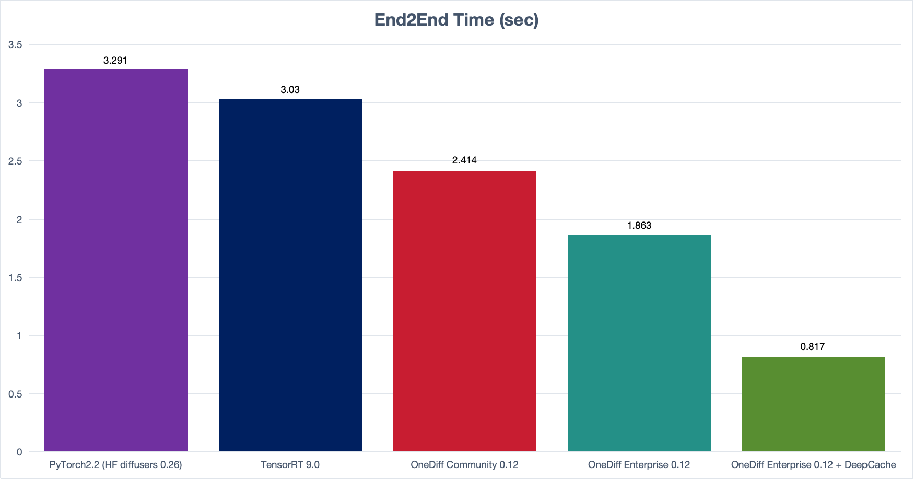
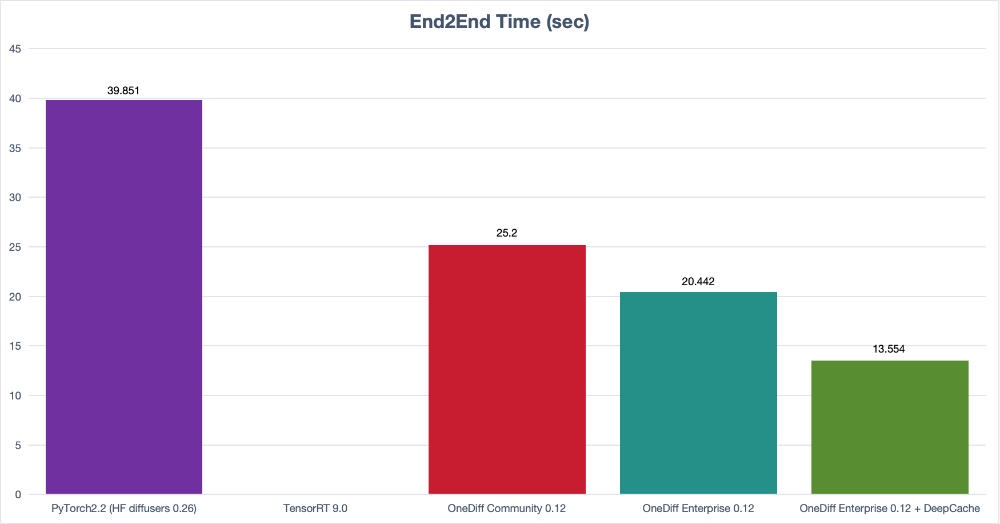

<p align="center">

</p>

<p align="center">
  <a href="https://pypi.org/project/onediff" target="_blank"></a>
  <a href="https://pypistats.org/packages/onediff" target="_blank"></a>
  <a href="https://github.com/siliconflow/onediff?tab=Apache-2.0-1-ov-file#readme" target="_blank"></a>
  <a href="https://github.com/siliconflow/onediff/issues?q=is%3Aissue+is%3Aclosed" target="_blank"></a>
  <a href="https://github.com/siliconflow/onediff/issues?q=is%3Aopen+is%3Aissue" target="_blank"></a>
</p>

<p align="center">
  <a href="https://github.com/siliconflow/onediff/stargazers" target="_blank"></a>
  <a href="https://twitter.com/search?q=%22onediff%22&src=typed_query&f=live" target="_blank"></a>
  <a href="https://github.com/siliconflow/onediff/actions/workflows/sd.yml" target="_blank"></a>
  <a href="https://github.com/siliconflow/onediff/actions/workflows/examples.yml?query=event%3Aschedule" target="_blank"></a>
</p>
<p align="center">
  | <a href="https://github.com/siliconflow/onediff?tab=readme-ov-file#documentation"><b>Documentation</b></a> | <a href="https://github.com/siliconflow/onediff/wiki"><b>Community</b></a> | <a href="https://github.com/siliconflow/onediff/wiki/Contribution-Guide"><b>Contribution</b></a> | <a href="https://discord.gg/RKJTjZMcPQ"><b>Discord</b></a> |
</p>

---

**onediff** is an out-of-the-box acceleration library for diffusion models, it provides:
- Out-of-the-box **acceleration** for popular UIs/libs(such as **HF diffusers** and **ComfyUI**)
- PyTorch code **compilation tools** and strong optimized **GPU Kernels** for diffusion models

## News
- [2024/07/23] :rocket: Up to 1.7x Speedup for Kolors: [Kolors Acceleration Report](https://github.com/siliconflow/onediff/tree/main/onediff_diffusers_extensions/examples/kolors)
- [2024/06/18] :rocket: Acceleration for DiT models: [SD3 Acceleration Report](https://github.com/siliconflow/onediff/tree/main/onediff_diffusers_extensions/examples/sd3), [PixArt Acceleration Report](https://github.com/siliconflow/onediff/tree/main/onediff_diffusers_extensions/examples/pixart), and [Latte Acceleration Report](https://github.com/siliconflow/onediff/tree/main/onediff_diffusers_extensions/examples/latte)
- [2024/04/13] :rocket: [OneDiff 1.0 is released (Acceleration of SD & SVD with one line of code)](https://www.reddit.com/r/StableDiffusion/comments/1c5gy1e/onediff_10_is_out_acceleration_of_sd_svd_with_one/)
- [2024/01/12] :rocket: [Accelerating Stable Video Diffusion 3x faster with OneDiff DeepCache + Int8](https://www.reddit.com/r/StableDiffusion/comments/1adu2hn/accelerating_stable_video_diffusion_3x_faster/)
- [2023/12/19] :rocket: [Accelerating SDXL 3x faster with DeepCache and OneDiff](https://www.reddit.com/r/StableDiffusion/comments/18lz2ir/accelerating_sdxl_3x_faster_with_deepcache_and/)

## Hiring
We're hiring! If you are interested in working on onediff at SiliconFlow, we have roles open for [Interns](https://www.shixiseng.com/intern/inn_o2c63agwogc7) and [Engineers](https://www.zhipin.com/mpa/html/weijd/weijd-job/e03542c584120a261HN70ty7F1pW) in Beijing (near Tsinghua University).

If you have contributed significantly to open-source software and are interested in remote work, you can contact us at `talent@siliconflow.cn` with `onediff` in the email title.

---
<!-- toc -->
- [Documentation](#documentation)
  * [Use with HF diffusers and ComfyUI](#use-with-hf-diffusers-and-comfyui)
  * [Performance comparison](#performance-comparison)
    + [SDXL E2E time](#sdxl-e2e-time)
    + [SVD E2E time](#svd-e2e-time)
  * [Quality Evaluation](#quality-evaluation)
  * [Community and Support](#community-and-support)
  * [Installation](#installation)
    + [0. OS and GPU Compatibility](#0-os-and-gpu-compatibility)
    + [1. Install torch and diffusers](#1-install-torch-and-diffusers)
    + [2. Install a compiler backend](#2-install-a-compiler-backend)
      - [Nexfort](#nexfort)
      - [OneFlow](#oneflow)
    + [3. Install onediff](#3-install-onediff)
- [More about onediff](#more-about-onediff)
  * [Architecture](#architecture)
  * [Features](#features)
  * [Acceleration for State-of-the-art models](#acceleration-for-state-of-the-art-models)
  * [Acceleration for production environment](#acceleration-for-production-environment)
    + [PyTorch Module compilation](#pytorch-module-compilation)
    + [Avoid compilation time for new input shape](#avoid-compilation-time-for-new-input-shape)
    + [Avoid compilation time for online serving](#avoid-compilation-time-for-online-serving)
    + [Distributed Run](#distributed-run)
  * [OneDiff Enterprise Solution](#onediff-enterprise-solution)
<!-- tocstop -->

## Documentation
onediff is the abbreviation of "**one** line of code to accelerate **diff**usion models".

### Use with HF diffusers and ComfyUI
- [onediff for HF diffusers 🤗](https://github.com/siliconflow/onediff/tree/main/onediff_diffusers_extensions)
- [onediff for ComfyUI](https://github.com/siliconflow/onediff/tree/main/onediff_comfy_nodes)
- [onediff for Stable Diffusion web UI](https://github.com/siliconflow/onediff/tree/main/onediff_sd_webui_extensions)

### Performance comparison



#### SDXL E2E time
- Model stabilityai/stable-diffusion-xl-base-1.0;
- Image size 1024*1024, batch size 1, steps 30;
- NVIDIA A100 80G SXM4;



#### SVD E2E time
- Model stabilityai/stable-video-diffusion-img2vid-xt;
- Image size 576*1024, batch size 1, steps 25, decoder chunk size 5;
- NVIDIA A100 80G SXM4;



Note that we haven't got a way to run SVD with TensorRT on Feb 29 2024.

### Quality Evaluation
We also maintain a repository for benchmarking the quality of generation after acceleration: [odeval](https://github.com/siliconflow/odeval)

### Community and Support
- [Create an issue](https://github.com/siliconflow/onediff/issues)
- Chat in Discord: [](https://discord.gg/RKJTjZMcPQ)
- [Community and Feedback](https://github.com/siliconflow/onediff/wiki)

### Installation
#### 0. OS and GPU Compatibility
- Linux
  - If you want to use onediff on Windows, please use it under WSL.
  - [The guide to install onediff in WSL2](https://github.com/siliconflow/onediff/wiki/Run-OneDiff-on-Windows-by-WSL2).
- NVIDIA GPUs
  - [Compatibility with Nvidia GPUs](https://github.com/siliconflow/onediff/wiki/Compatibility-with-Nvidia-GPUs).


#### 1. Install torch and diffusers
**Note: You can choose the latest versions you want for diffusers or transformers.**
```
python3 -m pip install "torch" "transformers==4.27.1" "diffusers[torch]==0.19.3"
```

#### 2. Install a compiler backend
When considering the choice between OneFlow and Nexfort, either one is optional, and only one is needed.

- For DiT structural models or H100 devices, it is recommended to use Nexfort.

- For all other cases, it is recommended to use OneFlow. Note that optimizations within OneFlow will gradually transition to Nexfort in the future.

##### Nexfort
Install Nexfort is Optional.
The detailed introduction of Nexfort is [here](https://github.com/siliconflow/onediff/tree/main/src/onediff/infer_compiler/backends/nexfort#readme).

```bash
python3 -m  pip install -U torch==2.3.0 torchvision==0.18.0 torchaudio==2.3.0 torchao==0.1
python3 -m  pip install -U nexfort
```

##### OneFlow
Install OneFlow is Optional.
> **_NOTE:_** We have updated OneFlow frequently for onediff, so please install OneFlow by the links below.

- **CUDA 11.8**

  For NA/EU users
  ```bash
  python3 -m pip install -U --pre oneflow -f https://github.com/siliconflow/oneflow_releases/releases/expanded_assets/community_cu118
  ```

  For CN users
  ```bash
  python3 -m pip install -U --pre oneflow -f https://oneflow-pro.oss-cn-beijing.aliyuncs.com/branch/community/cu118
  ```


<details>
<summary> Click to get OneFlow packages for other CUDA versions. </summary>

- **CUDA 12.1**

  For NA/EU users
  ```bash
  python3 -m pip install -U --pre oneflow -f https://github.com/siliconflow/oneflow_releases/releases/expanded_assets/community_cu122
  ```

  For CN users
  ```bash
  python3 -m pip install -U --pre oneflow -f https://oneflow-pro.oss-cn-beijing.aliyuncs.com/branch/community/cu122
  ```


- **CUDA 12.2**

  For NA/EU users
  ```bash
  python3 -m pip install -U --pre oneflow -f https://github.com/siliconflow/oneflow_releases/releases/expanded_assets/community_cu122
  ```
  For CN users
  ```bash
  python3 -m pip install -U --pre oneflow -f https://oneflow-pro.oss-cn-beijing.aliyuncs.com/branch/community/cu122
  ```

</details>


#### 3. Install onediff

- From PyPI
```
python3 -m pip install --pre onediff
```
- From source
```
git clone https://github.com/siliconflow/onediff.git
```
```
cd onediff && python3 -m pip install -e .
```
Or install for development:
```
# install for dev
cd onediff && python3 -m pip install -e '.[dev]'

# code formatting and linting
pip3 install pre-commit
pre-commit install
pre-commit run --all-files
```

> **_NOTE:_** If you intend to utilize plugins for ComfyUI/StableDiffusion-WebUI, we highly recommend installing OneDiff from the source rather than PyPI. This is necessary as you'll need to manually copy (or create a soft link) for the relevant code into the extension folder of these UIs/Libs.

## More about onediff
### Architecture


### Features

| Functionality | Details |
|----------------|----------------------------|
| Compiling Time   | About 1 minute (SDXL) |
| Deployment Methods              | Plug and Play |
| Dynamic Image Size Support  | Support with no overhead |
| Model Support                 | SD1.5~2.1, SDXL, SDXL Turbo, etc. |
| Algorithm Support             | SD standard workflow, LoRA, ControlNet, SVD, InstantID, SDXL Lightning, etc. |
| SD Framework Support | ComfyUI, Diffusers, SD-webui |
| Save & Load Accelerated Models | Yes |
| Time of LoRA Switching | Hundreds of milliseconds |
| LoRA Occupancy | Tens of MB to hundreds of MB. |
| Device Support | NVIDIA GPU 3090 RTX/4090 RTX/A100/A800/A10 etc. (Compatibility with Ascend in progress) |


### Acceleration for State-of-the-art models
onediff supports the acceleration for SOTA models.
* stable: release for public usage, and has long-term support;
* beta: release for professional usage, and has long-term support;
* alpha: early release for expert usage, and should be careful to use;

| AIGC Type | Models                      | HF diffusers |            | ComfyUI   |            | SD web UI |            |
| --------- | --------------------------- | ------------ | ---------- | --------- | ---------- | --------- | ---------- |
|           |                             | Community    | Enterprise | Community | Enterprise | Community | Enterprise |
| Image     | SD 1.5                      | stable       | stable     | stable    | stable     | stable    | stable     |
|           | SD 2.1                      | stable       | stable     | stable    | stable     | stable    | stable     |
|           | SDXL                        | stable       | stable     | stable    | stable     | stable    | stable     |
|           | LoRA                        | stable       |            | stable    |            | stable    |            |
|           | ControlNet                  | stable       |            | stable    |            |           |            |
|           | SDXL Turbo                  | stable       |            | stable    |            |           |            |
|           | LCM                         | stable       |            | stable    |            |           |            |
|           | SDXL DeepCache              | alpha        | alpha      | alpha     | alpha      |           |            |
|           | InstantID                   | beta         |            | beta      |            |           |            |
| Video     | SVD(stable Video Diffusion) | stable       | stable     | stable    | stable     |           |            |
|           | SVD DeepCache               | alpha        | alpha      | alpha     | alpha      |           |            |

### Acceleration for production environment
#### PyTorch Module compilation
- [compilation with oneflow_compile](https://github.com/siliconflow/onediff/blob/main/onediff_diffusers_extensions/examples/text_to_image_sdxl.py)
#### Avoid compilation time for new input shape
- [Support Multi-resolution input](https://github.com/siliconflow/onediff/blob/main/onediff_diffusers_extensions/examples/text_to_image_sdxl.py)
#### Avoid compilation time for online serving
Compile and save the compiled result offline, then load it online for serving
- [Save and Load the compiled graph](https://github.com/siliconflow/onediff/blob/main/onediff_diffusers_extensions/examples/text_to_image_sdxl_save_load.py)
- Compile at one device(such as device 0), then use the compiled result to other device(such as device 1~7). [Change device of the compiled graph to do multi-process serving](https://github.com/siliconflow/onediff/blob/main/onediff_diffusers_extensions/examples/text_to_image_sdxl_mp_load.py)
#### Distributed Run
If you want to do distributed inference, you can use onediff's compiler to do single-device acceleration in a distributed inference engine such as [xDiT](https://github.com/xdit-project/xDiT)

### OneDiff Enterprise Solution
If you need Enterprise-level Support for your system or business, you can email us at contact@siliconflow.com, or contact us through the website: https://siliconflow.cn/pricing
|                                                          | Onediff Enterprise Solution                      |
| -------------------------------------------------------- | ------------------------------------------------ |
| More extreme compiler optimization for diffusion process | Usually another 20%~30% or more performance gain |
| End-to-end workflow speedup solutions                    | Sometimes 200%~300% performance gain             |
| End-to-end workflow deployment solutions                 | Workflow to online model API                     |
| Technical support for deployment                         | High priority support                            |

## Citation
```bibtex
@misc{2022onediff,
  author={OneDiff Contributors},
  title = {OneDiff: An out-of-the-box acceleration library for diffusion models},
  year = {2022},
  publisher = {GitHub},
  journal = {GitHub repository},
  howpublished = {\url{https://github.com/siliconflow/onediff}}
}
```
