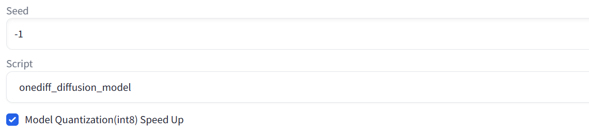

# OneDiff Enterprise

<p align="center">

</p>

OneDiff Enterprise offers a quantization method that reduces memory usage, increases speed, and maintains quality without any loss.

**Note**: Before proceeding with this document, please ensure you are familiar with the OneDiff Community features by referring to the [OneDiff Community README](./README.md).

- [OneDiff Enterprise](#onediff-enterprise)
  - [Get the license key](#get-the-license-key)
  - [Install OneDiff Enterprise](#install-onediff-enterprise)
    - [For NA/EU users](#for-naeu-users)
    - [For CN users](#for-cn-users)
  - [ComfyUI with OneDiff Enterprise](#comfyui-with-onediff-enterprise)
    - [Online Quantization for ComfyUI](#online-quantization-for-comfyUI)
    - [ComfyUI SD 1.5](#comfyui-sd-15)
    - [ComfyUI SD 2.1](#comfyui-sd-21)
    - [ComfyUI SDXL](#comfyui-sdxl)
    - [ComfyUI SVD](#comfyui-svd)
  - [Stable Diffusion WebUI with OneDiff Enterprise](#stable-diffusion-webui-with-onediff-enterprise)
    - [Online Quantization](#online-quantization)
    - [Offline Quantization](#offline-quantization)
  - [Diffusers with OneDiff Enterprise](#diffusers-with-onediff-enterprise)
    - [Accessing Diffusers Models](#accessing-diffusers-models)
      - [Diffusers-SD-1.5](#diffusers-sd-15)
      - [Scripts](#scripts)
      - [Diffusers-SD-2.1](#diffusers-sd-21)
      - [Diffusers-SD-1.5 + DeepCache](#diffusers-sd-15--deepcache)
    - [Diffusers SDXL](#diffusers-sdxl)
      - [Accessing Diffusers Models](#accessing-diffusers-models-1)
      - [Scripts](#scripts-1)
      - [SDXL + DeepCache](#sdxl--deepcache)
    - [Diffusers SVD](#diffusers-svd)
      - [Accessing Diffusers Models](#accessing-diffusers-models-2)
      - [Scripts](#scripts-2)
      - [SVD + DeepCache](#svd--deepcache)
  - [Quantitative model](#quantitative-model)
  - [Contact](#contact)


## Get the license key

Purchase license key from [SiliconFlow website](https://www.siliconflow.com/onediff.html) or contact contact@siliconflow.com if you encounter any issues.Alternatively, you can [contact](#contact) us to inquire about purchasing the OneDiff Enterprise license.

Once you have completed your purchase, you can execute the following\
```export SILICON_ONEDIFF_LICENSE_KEY= $YOUR_KEY ```\
in the terminal

## Install OneDiff Enterprise

### For NA/EU users

**CUDA 11.8**

```bash
python3 -m pip install --pre oneflow -f https://github.com/siliconflow/oneflow_releases/releases/expanded_assets/enterprise_cu118 && \
python3 -m pip install --pre onediff-quant -f https://github.com/siliconflow/onediff_releases/releases/expanded_assets/enterprise && \
python3 -m pip install git+https://github.com/siliconflow/onediff.git@main#egg=onediff
```

**CUDA 12.1**

```bash
python3 -m pip install --pre oneflow -f https://github.com/siliconflow/oneflow_releases/releases/expanded_assets/enterprise_cu121 && \
python3 -m pip install --pre onediff-quant -f https://github.com/siliconflow/onediff_releases/releases/expanded_assets/enterprise && \
python3 -m pip install git+https://github.com/siliconflow/onediff.git@main#egg=onediff
```

**CUDA 12.2**

```bash
python3 -m pip install --pre oneflow -f https://github.com/siliconflow/oneflow_releases/releases/expanded_assets/enterprise_cu122 && \
python3 -m pip install --pre onediff-quant -f https://github.com/siliconflow/onediff_releases/releases/expanded_assets/enterprise && \
python3 -m pip install git+https://github.com/siliconflow/onediff.git@main#egg=onediff
```

### For CN users

**CUDA 11.8**

```bash
python3 -m pip install --pre oneflow -f https://oneflow-pro.oss-cn-beijing.aliyuncs.com/branch/main/cu118/ && \
python3 -m pip install --pre onediff-quant -f https://oneflow-pro.oss-cn-beijing.aliyuncs.com/onediff-quant/ && \
python3 -m pip install git+https://github.com/siliconflow/onediff.git@main#egg=onediff
```

**CUDA 12.1**

```bash
python3 -m pip install --pre oneflow -f https://oneflow-pro.oss-cn-beijing.aliyuncs.com/branch/main/cu121/ && \
python3 -m pip install --pre onediff-quant -f https://oneflow-pro.oss-cn-beijing.aliyuncs.com/onediff-quant/ && \
python3 -m pip install git+https://github.com/siliconflow/onediff.git@main#egg=onediff
```

**CUDA 12.2**

```bash
python3 -m pip install --pre oneflow -f https://oneflow-pro.oss-cn-beijing.aliyuncs.com/branch/main/cu122/ && \
python3 -m pip install --pre onediff-quant -f https://oneflow-pro.oss-cn-beijing.aliyuncs.com/onediff-quant/ && \
python3 -m pip install git+https://github.com/siliconflow/onediff.git@main#egg=onediff
```

## ComfyUI with OneDiff Enterprise

Ensure that you have installed [OneDiff ComfyUI Nodes](onediff_comfy_nodes/README.md#setup-enterprise-edition) and follow the instructions below.

**NOTE1**: Place the `*.pt` files from the HuggingFace repositories into the `ComfyUI/models/onediff_quant` subfolder. If the `onediff_quant` folder does not exist, please create it.

**NOTE2**: It should be noted that you need to make sure you are logged in to [Hugging Face](https://huggingface.co/) before clicking the "Workflow" link below.

<a id="online-quantization-for-comfyUI"></a>
### Online Quantization for ComfyUI

  We provide ComfyUI with an online quantification tool, which has significant acceleration effects. We provide detailed documentation tutorials [ComfyUI online quantization usage documentation](./onediff_comfy_nodes/ComfyUI_Online_Quantization.md) for users who want to use.


<a id="comfyui-sd-1-5"></a>
### ComfyUI SD 1.5


  For more information and to **access the model files and Workflow below**, please visit [Hugging Face - stable-diffusion-v1-5-onediff-enterprise-v1](https://huggingface.co/siliconflow/stable-diffusion-v1-5-onediff-comfy-enterprise-v1/tree/main).

<details>
<summary> Download the required model files </summary>

1. Download the [`v1-5-pruned.safetensors`](https://huggingface.co/runwayml/stable-diffusion-v1-5/resolve/main/v1-5-pruned.safetensors) file and place it in the `ComfyUI/models/checkpoints/` directory:

```bash
wget https://huggingface.co/runwayml/stable-diffusion-v1-5/resolve/main/v1-5-pruned.safetensors -O ComfyUI/models/checkpoints/v1-5-pruned.safetensors
```

2. Download the [`v1-5-pruned_quantize_info.pt`](https://huggingface.co/siliconflow/stable-diffusion-v1-5-onediff-comfy-enterprise-v1/resolve/main/v1-5-pruned_quantize_info.pt) file and place it in the `ComfyUI/models/onediff_quant/` directory:

```bash
wget https://huggingface.co/siliconflow/stable-diffusion-v1-5-onediff-comfy-enterprise-v1/resolve/main/v1-5-pruned_quantize_info.pt -O ComfyUI/models/onediff_quant/v1-5-pruned_quantize_info.pt
```

</details>

Click the links below to view the workflow images, or load them directly into ComfyUI.

  - Workflow: [SD 1.5](https://huggingface.co/siliconflow/stable-diffusion-v1-5-onediff-comfy-enterprise-v1/blob/main/comfyui_screenshots/onediff_quant_advanced.png)

<a id="comfyui-sd-2-1"></a>
### ComfyUI SD 2.1


  For more information and to **access the model files and Workflow below**, please visit [Hugging Face - stable-diffusion-v2-1-onediff-enterprise](https://huggingface.co/siliconflow/stable-diffusion-v2-1-onediff-comfy-enterprise/tree/main).

<details>
<summary> Download the required model files </summary>

1. Download the [`v2-1_768-ema-pruned.zip`](https://huggingface.co/siliconflow/stable-diffusion-v2-1-onediff-comfy-enterprise/blob/main/v2-1_768-ema-pruned.zip) file and unzip ,then place the .safetensors in the `ComfyUI/models/checkpoints/` directory:

```bash
wget https://huggingface.co/siliconflow/stable-diffusion-v2-1-onediff-comfy-enterprise/blob/main/v2-1_768-ema-pruned.zip -O ComfyUI/models/checkpoints/v2-1_768-ema-pruned.zip
```

2. Download the [`v2-1-onediff-comfy-enterprise.pt`](https://huggingface.co/siliconflow/stable-diffusion-v2-1-onediff-comfy-enterprise/blob/main/v2-1_768-ema-pruned.pt) file and place it in the `ComfyUI/models/onediff_quant/` directory:

```bash
wget https://huggingface.co/siliconflow/stable-diffusion-v2-1-onediff-comfy-enterprise/blob/main/v2-1_768-ema-pruned.pt -O ComfyUI/models/onediff_quant/v1-5-pruned_quantize_info.pt
```

</details>

Click the links below to view the workflow images, or load them directly into ComfyUI.

  - Workflow: [SD 2.1](https://huggingface.co/siliconflow/stable-diffusion-v2-1-onediff-comfy-enterprise/blob/main/onediff_stable_diffusion_2_1.png)

### ComfyUI SDXL

  For model details and to **access the model files and Workflow below**, please  visit [Hugging Face - sdxl-base-1.0-onediff-comfy-enterprise-v1](https://huggingface.co/siliconflow/sdxl-base-1.0-onediff-comfy-enterprise-v1/tree/main).

<details>
<summary> Download the required model files </summary>

1. Download the [`sd_xl_base_1.0.safetensors`](https://huggingface.co/stabilityai/stable-diffusion-xl-base-1.0/resolve/main/sd_xl_base_1.0.safetensors) file and place it in the `ComfyUI/models/checkpoints/` directory:

```bash
wget https://huggingface.co/stabilityai/stable-diffusion-xl-base-1.0/resolve/main/sd_xl_base_1.0.safetensors -O ComfyUI/models/checkpoints/sd_xl_base_1.0.safetensors
```

2. Download the [`sd_xl_base_1.0_quantize_info.pt`](https://huggingface.co/siliconflow/sdxl-base-1.0-onediff-comfy-enterprise-v1/resolve/main/sd_xl_base_1.0_quantize_info.pt) file and place it in the `ComfyUI/models/onediff_quant/` directory:

```bash
wget https://huggingface.co/siliconflow/sdxl-base-1.0-onediff-comfy-enterprise-v1/resolve/main/sd_xl_base_1.0_quantize_info.pt -O ComfyUI/models/onediff_quant/sd_xl_base_1.0_quantize_info.pt
```
</details>


  - Workflow: [SDXL](https://huggingface.co/siliconflow/sdxl-base-1.0-onediff-comfy-enterprise-v1/blob/main/onediff_quant_base.png)
  - Workflow: [SDXL + DeepCache](https://huggingface.co/siliconflow/sdxl-base-1.0-onediff-comfy-enterprise-v1/blob/main/onediff_quant_deepcache.png)

### ComfyUI SVD


  For model details and to **access the model files and Workflow below**, visit [Hugging Face - stable-video-diffusion-xt-comfyui-deepcache-int8](https://huggingface.co/siliconflow/stable-video-diffusion-xt-comfyui-deepcache-int8).


<details>
<summary> Download the required model files </summary>

1. Download the [`svd_xt.safetensors`](https://huggingface.co/stabilityai/stable-video-diffusion-img2vid-xt/resolve/main/svd_xt.safetensors) or [`svd_xt_1_1.safetensors`](https://huggingface.co/stabilityai/stable-video-diffusion-img2vid-xt-1-1/blob/main/svd_xt_1_1.safetensors) file and place it in the `ComfyUI/models/checkpoints/` directory:

```bash
wget https://huggingface.co/stabilityai/stable-video-diffusion-img2vid-xt/resolve/main/svd_xt.safetensors -O ComfyUI/models/checkpoints/svd_xt.safetensors
```

2. Download the [`unet_SVD_img2vid_quantize_info.pt`](https://huggingface.co/siliconflow/stable-video-diffusion-xt-comfyui-deepcache-int8/resolve/main/unet_SVD_img2vid_quantize_info.pt) file and place it in the `ComfyUI/models/onediff_quant/` directory:

```bash
wget https://huggingface.co/siliconflow/stable-video-diffusion-xt-comfyui-deepcache-int8/resolve/main/unet_SVD_img2vid_quantize_info.pt -O ComfyUI/models/onediff_quant/unet_SVD_img2vid_quantize_info.pt
```
3. Download the [`unet_SVD_img2vid_quantize_deepcache_info.pt`](https://huggingface.co/siliconflow/stable-video-diffusion-xt-comfyui-deepcache-int8/resolve/main/unet_SVD_img2vid_quantize_deepcache_info.pt) file and place it in the `ComfyUI/models/onediff_quant/` directory:

```bash
wget https://huggingface.co/siliconflow/stable-video-diffusion-xt-comfyui-deepcache-int8/resolve/main/unet_SVD_img2vid_quantize_deepcache_info.pt -O ComfyUI/models/onediff_quant/unet_SVD_img2vid_quantize_deepcache_info.pt
```
</details>


  - Workflow: [SVD](https://huggingface.co/siliconflow/stable-video-diffusion-xt-comfyui-deepcache-int8/blob/main/svd-int8-workflow.png)

  - Workflow: [SVD + DeepCache](https://huggingface.co/siliconflow/stable-video-diffusion-xt-comfyui-deepcache-int8/blob/main/svd-int8-deepcache-workflow.png)


## Stable Diffusion WebUI with OneDiff Enterprise

We provide two types of quantization methods, online quantization and offline quantization.

Online quantization will quantize all Conv2d and Linear modules. Its advantages are as follows:

- Easy to use: The only thing you need to do is just ticking the **Model Quantization(int8) Speed Up** option.
- Fast: It can finish the quantification in a few seconds

Offline quantization requires you to manually run the quantization script we provide to obtain a quantized model, which can then be used in the WebUI. Its advantages are as follows:

- Better image quality: It can identify and quantize modules with high computational costs yet minimal impact on image quality, to achieve the optimal balance between computational costs and image quality.

### Online Quantization

Select *onediff_diffusion_model* in script, and a checkbox labeled *Model Quantization(int8) Speed Up* will appear below (as shown in the figure). By ticking this checkbox, you can use the online quantization function.



> Note: If you can't see the checkbox and instead see a message with the content *Hints: Enterprise function is not supported on your system*, it means that you do not have installed the onediff enterprise correctly. Please follow the instructions in the [Install OneDiff Enterprise](#install-onediff-enterprise) to install it.

### Offline Quantization

1. Enter the directory where OneDiff is installed and run the script as follows to quantize the model
    ```python
    python3 onediff_diffusers_extensions/tools/quantization/quantize-sd-fast.py \
      --model /path/to/your/model \
      --quantized_model /path/to/save/quantized/model \
      --height 512 \
      --width 512 \
      --conv_ssim_threshold 0.991 \
      --linear_ssim_threshold 0.991 \
      --conv_compute_density_threshold 0 \
      --linear_compute_density_threshold 0 \
      --save_as_float true \
      --cache_dir /path/to/save/quantized/cache
    ```

    The meaning of each parameter is as follows:

    `--model` Specifies the path of the model to be quantified, can be a diffusers format model (which is a folder containing unet, vae, text_encoder and etc.) or a single safetensors file

    `--quantized_model` Specifies the path to save the quantized model

    `--height --width` Specify the height and width of the output image which are the most commonly used height and width in your WebUI usage

    `--conv_ssim_threshold` A similarity threshold that quantize convolution. The higher the threshold, the lower the accuracy loss caused by quantization, should be greater than 0 and smaller than 1

    `--linear_ssim_threshold` A similarity threshold that quantize linear. The higher the threshold, the lower the accuracy loss caused by quantization, should be greater than 0 and smaller than 1

    `--conv_compute_density_threshold` The conv modules whose computational density is higher than the threshold will be quantized. Default to 900

    `--linear_compute_density_threshold` The linear modules whose computational density is higher than the threshold will be quantized. Default to 300

    `--save_as_float` If save model with floating point weights. If set to true, the weight of quantized modules will be saved as floating point dtype, otherwise int dtype.

    `--cache_dir` Specifies the path to save the cache when quantizing. You can use the cache to re-quantize one model without re-computing

2. convert quantized model to origial Stable Diffusion single safetensors file by running the scirpt (if you want to convert SDXL model, use `onediff_sd_webui_extensions/tools/convert_diffusers_to_sdxl.py` instead)
    ```python
    python3 onediff_sd_webui_extensions/tools/convert_diffusers_to_sd.py \
      --model_path /path/to/saved/quantized/model \
      --checkpoint_path /path/to/save/quantized/safetensors \
      --use_safetensors
    ```
Then you can get the offline quantized model in the path specified by `--checkpoint_path`and use it in WebUI (remember to tick the **Model Quantization(int8) Speed Up** option).

> Note:
> - Make sure that the safetensors file and the {model_name}_sd_calibrate_info.txt file are in the same folder, so that the OneDiff script can read the calibration file for this offline quantization model.
>
> - When you set conv_ssim_threshold and linear_ssim_threshold to a too high value, the number of quantized modules will be very few, and you will obtain too low acceleration benefits.
>
> - When you set conv_ssim_threshold and linear_ssim_threshold to a too low value, the number of quantized modules will be very large, and you will obtain a higher acceleration benefits, but the quality of generated image may decrease significantly
>
> - When you are using offline quantized model, do remember to tick the **Model Quantization(int8) Speed Up** option, otherwise abnormal image may be generated.


## Diffusers with OneDiff Enterprise

### Accessing Diffusers Models

To download the necessary models, please visit the [siliconflow/stable-diffusion-v1-5-onediff-enterprise](https://huggingface.co/siliconflow/stable-diffusion-v1-5-onediff-enterprise) on HuggingFace. Please visit [Hugging Face - stable-diffusion-v2-1-onediff-enterprise](https://huggingface.co/siliconflow/stable-diffusion-v2-1-onediff-enterprise). Additionally, to use the quantized model customized for DeepCache, please visit the [siliconflow/stable-diffusion-v1-5-onediff-deepcache-int8](https://huggingface.co/siliconflow/stable-diffusion-v1-5-onediff-deepcache-int8).

<a id="diffusers-sd-1-5"></a>
#### Diffusers-SD-1.5

#### Scripts

Run [text_to_image_sd_enterprise.py](onediff_diffusers_extensions/examples/text_to_image_sd_enterprise.py) by command:

```bash
python text_to_image_sd_enterprise.py --model $model_path --saved_image output_sd.png
```

Type `python3 text_to_image_sd_enterprise.py -h` for more options.

<a id="diffusers-sd-2-1"></a>
#### Diffusers-SD-2.1

```bash
python text_to_image_sd_enterprise.py --model $model_path --saved_image output_sd.png
```

#### Diffusers-SD-1.5 + DeepCache

Ensure that you have installed [OneDiffX](onediff_diffusers_extensions/README.md#install-and-setup) and then run [text_to_image_deep_cache_sd_sdxl_enterprise.py](onediff_diffusers_extensions/examples/text_to_image_deep_cache_sd_sdxl_enterprise.py) by command:

```bash
python text_to_image_deep_cache_sd_sdxl_enterprise.py --model $model_path --model_type sd --saved_image output_deepcache_sd.png
```

### Diffusers SDXL

#### Accessing Diffusers Models

To download the necessary models, please visit the [siliconflow/sdxl-base-1.0-onediff-enterprise-v2](https://huggingface.co/siliconflow/sdxl-base-1.0-onediff-enterprise-v2/tree/main) on HuggingFace.

#### Scripts

Run [text_to_image_sdxl_enterprise.py](onediff_diffusers_extensions/examples/text_to_image_sdxl_enterprise.py) by command:

```bash
python text_to_image_sdxl_enterprise.py --model $model_path --saved_image output_sdxl.png
```

Type `python3 text_to_image_sdxl_enterprise.py -h` for more options.

#### SDXL + DeepCache

Ensure that you have installed [OneDiffX](onediff_diffusers_extensions/README.md#install-and-setup) and then run [text_to_image_deep_cache_sd_sdxl_enterprise.py](onediff_diffusers_extensions/examples/text_to_image_deep_cache_sd_sdxl_enterprise.py) by command:

```bash
python text_to_image_deep_cache_sd_sdxl_enterprise.py --model $model_path --model_type sdxl --saved_image output_deepcache.png
```

### Diffusers SVD

#### Accessing Diffusers Models

To download the necessary models, please visit the [siliconflow/stable-video-diffusion-img2vid-xt-deepcache-int8](https://huggingface.co/siliconflow/stable-video-diffusion-img2vid-xt-deepcache-int8) on HuggingFace.

#### Scripts

Run [image_to_video.py](benchmarks/image_to_video.py):

```bash
python3 benchmarks/image_to_video.py \
  --model $model_path \
  --input-image path/to/input_image.jpg \
  --output-video path/to/output_image.mp4
```

#### SVD + DeepCache

```bash
python3 benchmarks/image_to_video.py \
  --model $model_path \
  --deepcache \
  --input-image path/to/input_image.jpg \
  --output-video path/to/output_image.mp4
```

## Quantitative model
Due to space limitations, specific quantification-related documents can be found in the [quantization document](./src/onediff/quantization/README.md#how-to-use-onediff-quantization).

## Contact

For users of OneDiff Community, please visit [GitHub Issues](https://github.com/siliconflow/onediff/issues) for bug reports and feature requests.

For users of OneDiff Enterprise, you can contact contact@siliconflow.com for commercial support.

Feel free to join our [Discord](https://discord.gg/RKJTjZMcPQ) community for discussions and to receive the latest updates.
