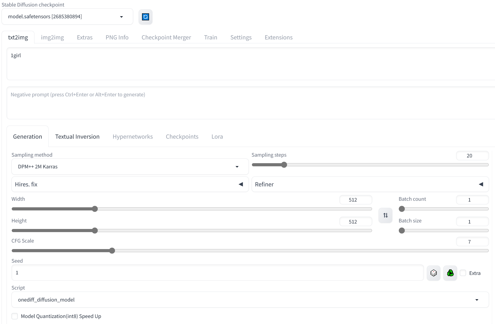

# OneDiff Enterprise

<p align="center">

</p>

OneDiff Enterprise offers a quantization method that reduces memory usage, increases speed, and maintains quality without any loss.

**Note**: Before proceeding with this document, please ensure you are familiar with the OneDiff Community features by referring to the [OneDiff Community README](./README.md).

- [Get the license key](#get-the-license-key)
- [Install OneDiff Enterprise](#install-onediff-enterprise)
    - [For NA/EU users](#for-naeu-users)
    - [For CN users](#for-cn-users)
- [ComfyUI with OneDiff Enterprise](#comfyui-with-onediff-enterprise)
    - [SD-1.5](#SD-1.5)
    - [SDXL](#SDXL)
    - [SVD](#SVD)
- [Stable Diffusion WebUI with OneDiff Enterprise](#stable-diffusion-webui-with-onediff-enterprise)
    - [SD-1.5](#SD-1.5)
- [Diffusers with OneDiff Enterprise](#diffusers-with-onediff-enterprise)
    - [SDXL](#SDXL)
    - [SVD](#SVD)


## Get the license key

Purchase license key from [SiliconFlow website](https://www.siliconflow.com/onediff.html) or contact contact@siliconflow.com if you encounter any issues.

Alternatively, you can [contact](#contact) us to inquire about purchasing the OneDiff Enterprise license.

## Install OneDiff Enterprise

### For NA/EU users

**CUDA 11.8**

```bash
python3 -m pip install --pre oneflow -f https://github.com/siliconflow/oneflow_releases/releases/expanded_assets/enterprise_cu118 && \
python3 -m pip install --pre onediff-quant -f https://github.com/siliconflow/onediff_releases/releases/expanded_assets/enterprise && \
python3 -m pip install git+https://github.com/siliconflow/onediff.git@main#egg=onediff
```

**CUDA 12.1**

```bash
python3 -m pip install --pre oneflow -f https://github.com/siliconflow/oneflow_releases/releases/expanded_assets/enterprise_cu121 && \
python3 -m pip install --pre onediff-quant -f https://github.com/siliconflow/onediff_releases/releases/expanded_assets/enterprise && \
python3 -m pip install git+https://github.com/siliconflow/onediff.git@main#egg=onediff
```

**CUDA 12.2**

```bash
python3 -m pip install --pre oneflow -f https://github.com/siliconflow/oneflow_releases/releases/expanded_assets/enterprise_cu122 && \
python3 -m pip install --pre onediff-quant -f https://github.com/siliconflow/onediff_releases/releases/expanded_assets/enterprise && \
python3 -m pip install git+https://github.com/siliconflow/onediff.git@main#egg=onediff
```

### For CN users

**CUDA 11.8**

```bash
python3 -m pip install --pre oneflow -f https://oneflow-pro.oss-cn-beijing.aliyuncs.com/branch/main/cu118/ && \
python3 -m pip install --pre onediff-quant -f https://oneflow-pro.oss-cn-beijing.aliyuncs.com/onediff-quant/ && \
python3 -m pip install git+https://github.com/siliconflow/onediff.git@main#egg=onediff
```

**CUDA 12.1**

```bash
python3 -m pip install --pre oneflow -f https://oneflow-pro.oss-cn-beijing.aliyuncs.com/branch/main/cu121/ && \
python3 -m pip install --pre onediff-quant -f https://oneflow-pro.oss-cn-beijing.aliyuncs.com/onediff-quant/ && \
python3 -m pip install git+https://github.com/siliconflow/onediff.git@main#egg=onediff
```

**CUDA 12.2**

```bash
python3 -m pip install --pre oneflow -f https://oneflow-pro.oss-cn-beijing.aliyuncs.com/branch/main/cu122/ && \
python3 -m pip install --pre onediff-quant -f https://oneflow-pro.oss-cn-beijing.aliyuncs.com/onediff-quant/ && \
python3 -m pip install git+https://github.com/siliconflow/onediff.git@main#egg=onediff
```

## ComfyUI with OneDiff Enterprise

Ensure that you have installed [OneDiff ComfyUI Nodes](onediff_comfy_nodes/README.md#setup-enterprise-edition) and follow the instructions below.

**NOTE**: Place the `*.pt` files from the HuggingFace repositories into the `ComfyUI/models/onediff_quant` subfolder. If the `onediff_quant` folder does not exist, please create it.

### SD-1.5


  For more information and to access the model, visit [Hugging Face - stable-diffusion-v1-5-onediff-enterprise-v1](https://huggingface.co/siliconflow/stable-diffusion-v1-5-onediff-comfy-enterprise-v1/tree/main).

<details> 
<summary> Download the required model files </summary>

1. Download the [`v1-5-pruned.safetensors`](https://huggingface.co/runwayml/stable-diffusion-v1-5/resolve/main/v1-5-pruned.safetensors) file and place it in the `ComfyUI/models/checkpoints/` directory:

```bash
wget https://huggingface.co/runwayml/stable-diffusion-v1-5/resolve/main/v1-5-pruned.safetensors -O ComfyUI/models/checkpoints/v1-5-pruned.safetensors
```

2. Download the [`v1-5-pruned_quantize_info.pt`](https://huggingface.co/siliconflow/stable-diffusion-v1-5-onediff-comfy-enterprise-v1/resolve/main/v1-5-pruned_quantize_info.pt) file and place it in the `ComfyUI/models/onediff_quant/` directory:

```bash
wget https://huggingface.co/siliconflow/stable-diffusion-v1-5-onediff-comfy-enterprise-v1/resolve/main/v1-5-pruned_quantize_info.pt -O ComfyUI/models/onediff_quant/v1-5-pruned_quantize_info.pt
```

</details>

Click the links below to view the workflow images, or load them directly into ComfyUI.

  - Workflow: [SD 1.5](https://huggingface.co/siliconflow/stable-diffusion-v1-5-onediff-enterprise-v1/blob/main/comfyui_screenshots/onediff_quant_advanced.png)

### SDXL

  For model details, visit [Hugging Face - sdxl-base-1.0-onediff-comfy-enterprise-v1](https://huggingface.co/siliconflow/sdxl-base-1.0-onediff-comfy-enterprise-v1/tree/main).

<details> 
<summary> Download the required model files </summary>

1. Download the [`sd_xl_base_1.0.safetensors`](https://huggingface.co/stabilityai/stable-diffusion-xl-base-1.0/resolve/main/sd_xl_base_1.0.safetensors) file and place it in the `ComfyUI/models/checkpoints/` directory:

```bash
wget https://huggingface.co/stabilityai/stable-diffusion-xl-base-1.0/resolve/main/sd_xl_base_1.0.safetensors -O ComfyUI/models/checkpoints/sd_xl_base_1.0.safetensors
```

2. Download the [`sd_xl_base_1.0_quantize_info.pt`](https://huggingface.co/siliconflow/sdxl-base-1.0-onediff-comfy-enterprise-v1/resolve/main/sd_xl_base_1.0_quantize_info.pt) file and place it in the `ComfyUI/models/onediff_quant/` directory:

```bash
wget https://huggingface.co/siliconflow/sdxl-base-1.0-onediff-comfy-enterprise-v1/resolve/main/sd_xl_base_1.0_quantize_info.pt -O ComfyUI/models/onediff_quant/sd_xl_base_1.0_quantize_info.pt
```
</details>


  - Workflow: [SDXL](https://huggingface.co/siliconflow/sdxl-base-1.0-onediff-comfy-enterprise-v1/blob/main/onediff_quant_base.png)
  - Workflow: [SDXL + DeepCache](https://huggingface.co/siliconflow/sdxl-base-1.0-onediff-comfy-enterprise-v1/blob/main/onediff_quant_deepcache.png)

### SVD


  For model details, visit [Hugging Face - stable-video-diffusion-xt-comfyui-deepcache-int8](https://huggingface.co/siliconflow/stable-video-diffusion-xt-comfyui-deepcache-int8).


<details>
<summary> Download the required model files </summary>

1. Download the [`svd_xt.safetensors`](https://huggingface.co/stabilityai/stable-video-diffusion-img2vid-xt/resolve/main/svd_xt.safetensors) file and place it in the `ComfyUI/models/checkpoints/` directory:

```bash
wget https://huggingface.co/stabilityai/stable-video-diffusion-img2vid-xt/resolve/main/svd_xt.safetensors -O ComfyUI/models/checkpoints/svd_xt.safetensors
```

2. Download the [`unet_SVD_img2vid_quantize_info.pt`](https://huggingface.co/siliconflow/stable-video-diffusion-xt-comfyui-deepcache-int8/resolve/main/unet_SVD_img2vid_quantize_info.pt) file and place it in the `ComfyUI/models/onediff_quant/` directory:

```bash
wget https://huggingface.co/siliconflow/stable-video-diffusion-xt-comfyui-deepcache-int8/resolve/main/unet_SVD_img2vid_quantize_info.pt -O ComfyUI/models/onediff_quant/unet_SVD_img2vid_quantize_info.pt
```
3. Download the [`unet_SVD_img2vid_quantize_deepcache_info.pt`](https://huggingface.co/siliconflow/stable-video-diffusion-xt-comfyui-deepcache-int8/resolve/main/unet_SVD_img2vid_quantize_deepcache_info.pt) file and place it in the `ComfyUI/models/onediff_quant/` directory:

```bash
wget https://huggingface.co/siliconflow/stable-video-diffusion-xt-comfyui-deepcache-int8/resolve/main/unet_SVD_img2vid_quantize_deepcache_info.pt -O ComfyUI/models/onediff_quant/unet_SVD_img2vid_quantize_deepcache_info.pt
```
</details>


  - Workflow: [SVD](https://huggingface.co/siliconflow/stable-video-diffusion-xt-comfyui-deepcache-int8/blob/main/svd-int8-workflow.png)
  - Workflow: [SVD + DeepCache](https://huggingface.co/siliconflow/stable-video-diffusion-xt-comfyui-deepcache-int8/blob/main/svd-int8-deepcache-workflow.png)


## Stable Diffusion WebUI with OneDiff Enterprise

If you are using the official weight of StableDiffusionXL, just tick the **Model Quantization(int8) Speed Up** option.


### SD-1.5

#### Scripts

Run quantize-sd-fast.py by command to get quantized model:

```python3
python3 quantize-sd-fast.py \
  --model /path/to/your/sd/model \
  --quantized_model /path/to/save/quantized/model \
  --height 512 \
  --width 512 \
  --conv_ssim_threshold 0.985 \
  --linear_ssim_threshold 0.991 \
  --linear_compute_density_threshold 900 \
  --format sd
```

The meaning of each parameter is as follows:

`--model` Specifies the path of the model to be quantified

`--quantized_model` Specifies the path to save the quantized model

`--height --width` Specify the size of the output image when quantizing

`--conv_ssim_threshold` A similarity threshold that quantize convolution. The higher the threshold, the lower the accuracy loss caused by quantization

`--linear_ssim_threshold` A similarity threshold that quantize linear. The higher the threshold, the lower the accuracy loss caused by quantization

`--linear_compute_density_threshold` The linear modules whose computational density is higher than the threshold will be quantized

`--format` must be one of ['diffusers', 'sd'], and defaults to 'sd'. If set to 'diffusers', the model will be saved in the format of huggingface diffusers; if set to 'sd', the model will be saved in the format of Stable Diffusion single safetensors

After the script has finished running, you will obtain the quantized model named `model.safetensors` in the folder specified by --quant_model, and now you can load the quantized model in Stable Diffusion WebUI.



> Note: When you are using a quantized model, you should **not** tick the **Model Quantization(int8) Speed Up** option.


## Diffusers with OneDiff Enterprise

### SDXL

#### Accessing Diffusers Models

To download the necessary models, please visit the [siliconflow/sdxl-base-1.0-onediff-enterprise-v2](https://huggingface.co/siliconflow/sdxl-base-1.0-onediff-enterprise-v2/tree/main) on HuggingFace.

#### Scripts

Run [text_to_image_sdxl_enterprise.py](onediff_diffusers_extensions/examples/text_to_image_sdxl_enterprise.py) by command:

```bash
python text_to_image_sdxl_enterprise.py --model $model_path --saved_image output_sdxl.png
```

Type `python3 text_to_image_sdxl_enterprise.py -h` for more options.

#### SDXL + DeepCache

Ensure that you have installed [OneDiffX](onediff_diffusers_extensions/README.md#install-and-setup) and then run [text_to_image_deep_cache_sdxl_enterprise.py](onediff_diffusers_extensions/examples/text_to_image_deep_cache_sdxl_enterprise.py) by command:

```bash
python text_to_image_deep_cache_sdxl_enterprise.py --model $model_path --saved_image output_deepcache.png
```

### SVD

#### Accessing Diffusers Models

To download the necessary models, please visit the [siliconflow/stable-video-diffusion-img2vid-xt-deepcache-int8](https://huggingface.co/siliconflow/stable-video-diffusion-img2vid-xt-deepcache-int8) on HuggingFace.

#### Scripts

Run [image_to_video.py](benchmarks/image_to_video.py):

```bash
python3 benchmarks/image_to_video.py \     
  --model $model_path \    
  --input-image path/to/input_image.jpg \     
  --output-video path/to/output_image.mp4   
```

#### SVD + DeepCache

```bash
python3 benchmarks/image_to_video.py \     
  --model $model_path \     
  --deepcache \     
  --input-image path/to/input_image.jpg \     
  --output-video path/to/output_image.mp4 
```


## Contact

For users of OneDiff Community, please visit [GitHub Issues](https://github.com/siliconflow/onediff/issues) for bug reports and feature requests.

For users of OneDiff Enterprise, you can contact contact@siliconflow.com for commercial support.

Feel free to join our [Discord](https://discord.gg/RKJTjZMcPQ) community for discussions and to receive the latest updates.
