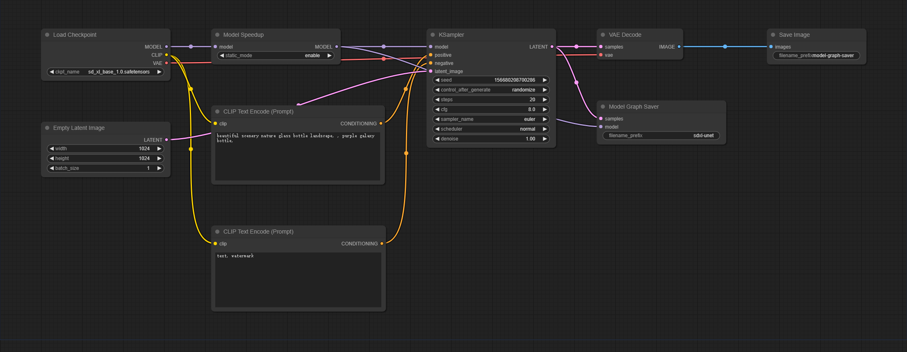
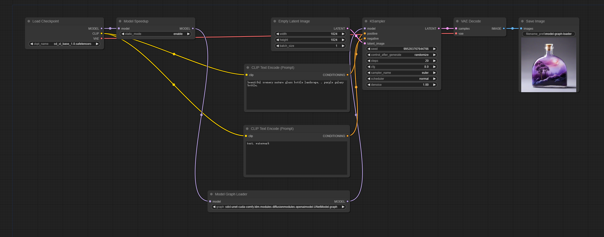
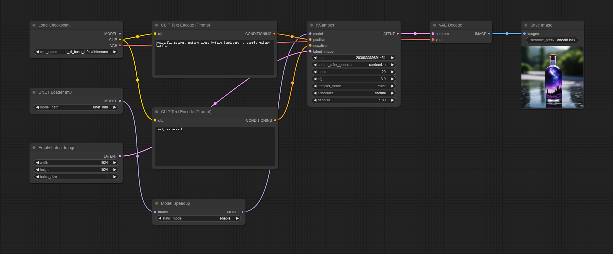
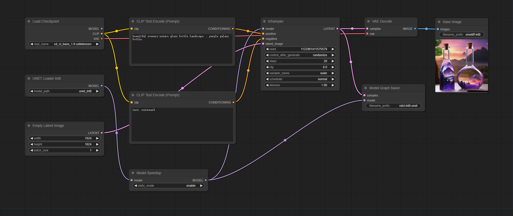
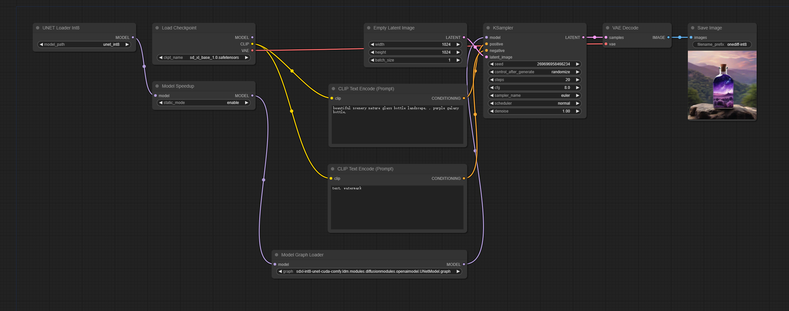
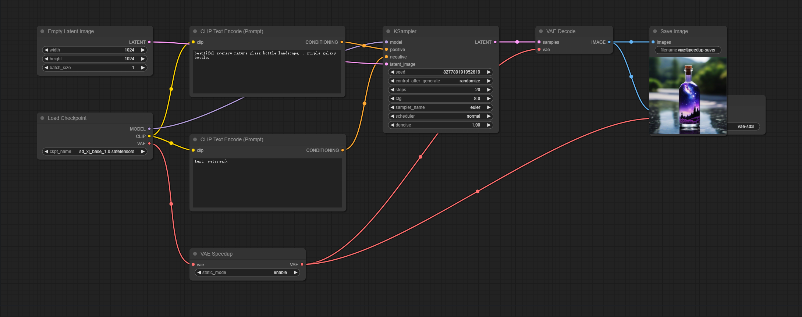
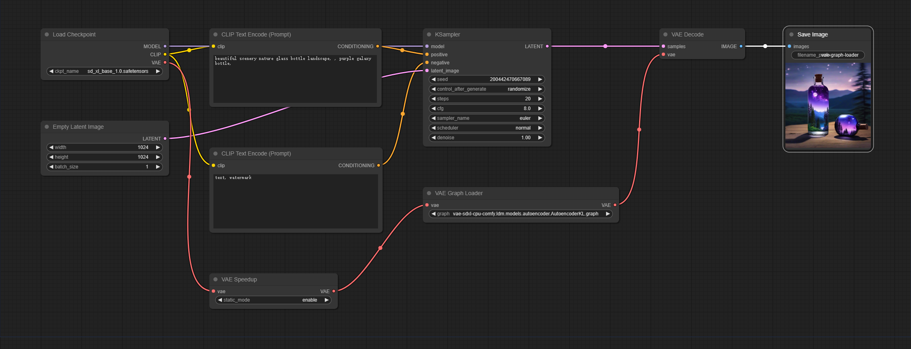
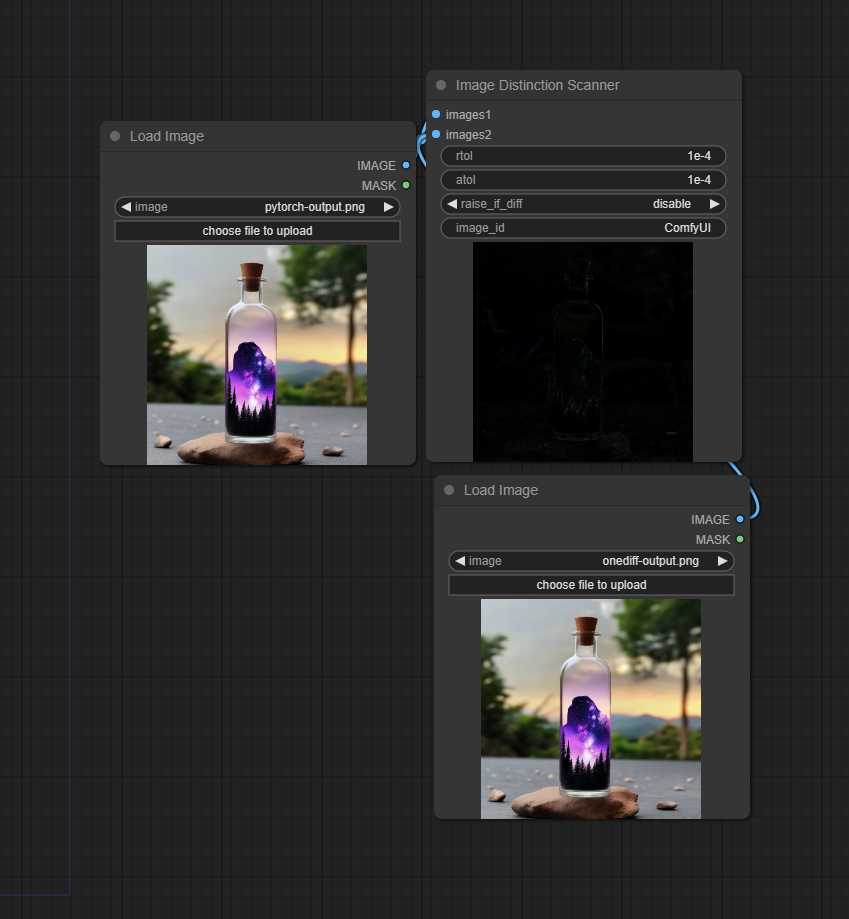

# OneDiff ComfyUI Nodes

- [OneDiff ComfyUI Nodes](#onediff-comfyui-nodes)
  - [Performance of Community Edition](#performance-of-community-edition)
  - [Installation Guide](#installation-guide)
  - [Basical Nodes Usage](#basical-nodes-usage)
    - [Model Acceleration](#model-acceleration)
      - [Model Speedup](#model-speedup)
      - [Model Graph Saver](#model-graph-saver)
      - [Model Graph Loader](#model-graph-loader)
    - [Quantization](#quantization)
    - [Image Distinction Scanner](#image-distinction-scanner)
  - [Examples](#onediff-community-examples)
    - [LoRA](#lora)
    - [ControlNet](#controlnet)
    - [SVD](#svd)
    - [DeepCache](#deepcache)


## Performance of Community Edition

Updated on DEC 7, 2023. Device: RTX 3090

| SDXL1.0-base (1024x1024)                         | torch(Baseline) | onediff(Optimized) | Percentage improvement |
|--------------------------------------------------|-----------------|--------------------|------------------------|
| [Stable Diffusion workflow(UNet)](workflows/model-speedup.png)    | 4.08it/s        | 6.13it/s           | 50.25%                 |
| [LoRA workflow](workflows/model-speedup-lora.png) | 4.05it/s        | 6.14it/s           | 51.60%                 |


## Installation Guide

1. Install and set up [ComfyUI](https://github.com/comfyanonymous/ComfyUI)


2. Install PyTorch and OneFlow

Install PyTorch:

```bash
pip install torch torchvision torchaudio
```

Install OneFlow Community(CUDA 11.x)

```bash
pip install --pre oneflow -f https://oneflow-pro.oss-cn-beijing.aliyuncs.com/branch/community/cu118
```

Install OneFlow Community(CUDA 12.x)

```bash
pip install --pre oneflow -f https://oneflow-pro.oss-cn-beijing.aliyuncs.com/branch/community/cu121
```

3. Intall onediff

```bash
git clone https://github.com/siliconflow/onediff.git
cd onediff && pip install -e .
```

5. Install onediff_comfy_nodes for ComfyUI

```bash
cd onediff
cp -r onediff_comfy_nodes path/to/ComfyUI/custom_nodes/
```

6. (Optional) Enterprise Level Support

If you need Enterprise Level Support for your system or business, please refer to [OneDiff Enterprise Edition](https://github.com/siliconflow/onediff/blob/main/README.md#onediff-enterprise-edition) .


## Basical Nodes Usage

**Note** All the images in this section can be loaded directly into ComfyUI. 

### Model Acceleration

#### Model Speedup

The "Model Speedup" node takes a model as input and outputs an optimized model.

If the `static_mode` is `enabled` (which is the default), it will take some time to compile before the first inference.

If `static_model` is `disabled`, there is no need for additional compilation time before the first inference, but the inference speed will be slower compared to `enabled`, albeit slightly.


#### Model Graph Saver

The optimized model from the "Model Speedup" node can be saved to "graph" by the "Model Graph Saver" node, allowing it to be used in other scenarios without the need for recompilation.



You can set different file name prefixes for different types of models.

#### Model Graph Loader

The "Model Graph Loader" node is used to load graph files from the disk, thus saving the time required for the initial compilation.



### Quantization

**Note: Quantization feature is only supported in OneDiff Enterprise.**

The "UNet Loader Int8" node is used to load quantized models. Quantized models need to be used in conjunction with the "Model Speedup" node.



The compilation result of the quantized model can also be saved as a graph and loaded when needed.

 





### VAE Acceleration

The VAE nodes used for accelerating, saving, and loading VAE graphs operate in a manner very similar to the usage of Model nodes.

Omitting specific details here, the following workflow can be loaded and tested.

**VAE Speedup and Graph Saver**



**VAE Speedup and Graph Loader**




### Image Distinction Scanner

The "Image Distinction Scanner" node is used to compare the differences between two images and visualize the resulting variances.



## OneDiff Community Examples 

### LoRA                  

This example shows you how to use Loras. You can change the LoRA models or adjust their strength without needing to recompile.

[Lora Speedup](workflows/model-speedup-lora.png)

### ControlNet

There is an example demonstrating openpose controlnet while OneDiff seamlessly supports a wide range of controlnet types, including depth mapping, canny, and more.

[ControlNet Speedup](workflows/model-speedup-controlnet.png)

### SVD

This example demonstrates the utilization of OneDiff to enhance the performance of a video model (text to video by SVD)

[SVD Speedup](workflows/text-to-video-speedup.png)

### DeepCache

DeepCache is an innovative algorithm designed to significantly enhance the speed of diffusion models by approximately 2x. When combined with OneDiff, it further accelerates the Diffusion model by around 3x.

Here are the example of applying DeepCache to SD and SVD models.

[Module DeepCache SpeedUp on SD](workflows/deep-cache.png)

[Module DeepCache SpeedUp on SVD](workflows/svd-deepcache.png)


