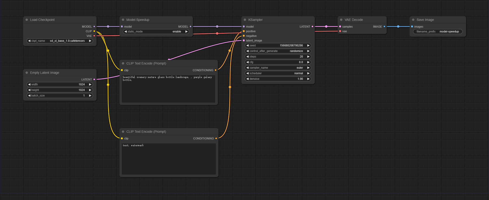
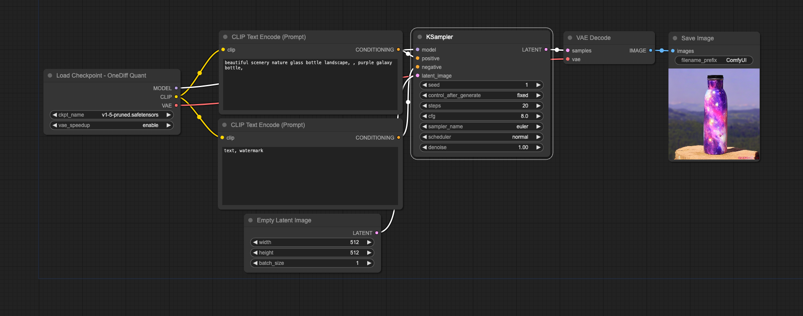

# OneDiff ComfyUI Nodes

<p align="center">

</p>

---

Performance of Community Edition 

Updated on January 23, 2024. Device: RTX 3090


<div align="center">
  
  **SDXL End2End Time** , Image Size 1024x1024 , Batch Size 1 , steps 20

  <a href="https://github.com/siliconflow/onediff/tree/main" target="_blank">
  </a>
</div>


<details>
<summary> Figure Notes </summary>

- Workflow Download Links
- [SDXL 1.0 (Base)](https://github.com/siliconflow/onediff/releases/download/0.12.0/basic_base.png)
- [SDXL 1.0 (OneDiff)](https://github.com/siliconflow/onediff/releases/download/0.12.0/basic_onediff.png)
- [LoRA (Base)](https://github.com/siliconflow/onediff/releases/download/0.12.0/lora_base.png)
- [LoRA (OneDiff)](https://github.com/siliconflow/onediff/releases/download/0.12.0/lora_onediff.png)
- [ControlNet (Base)](https://github.com/siliconflow/onediff/releases/download/0.12.0/controlnet_base.png)
- [ControlNet (OneDiff)](https://github.com/siliconflow/onediff/releases/download/0.12.0/controlnet_onediff.png)


</details>

## Documentation

- [OneDiff ComfyUI Nodes](#onediff-comfyui-nodes)
  - [Documentation](#documentation)
    - [Installation Guide](#installation-guide)
      - [Setup Community Edition](#setup-community-edition)
      - [Setup Enterprise Edition](#setup-enterprise-edition)
    - [Basical Nodes Usage](#basical-nodes-usage)
      - [Load Checkpoint - OneDiff](#load-checkpoint---onediff)
    - [Quantization](#quantization)
  - [OneDiff Community Examples](#onediff-community-examples)
    - [LoRA](#lora)
    - [ControlNet](#controlnet)
    - [SVD](#svd)
    - [DeepCache](#deepcache)
    - [InstantID](#instantid)
  - [Contact](#contact)


### Installation Guide

Please install and set up [ComfyUI](https://github.com/comfyanonymous/ComfyUI) first, and then:

#### Setup Community Edition

<details close>
<summary>Setup Community Edition</summary>

1. Install OneFlow Community
  * Install OneFlow Community(CUDA 11.x)

    ```bash
    pip install --pre oneflow -f https://oneflow-pro.oss-cn-beijing.aliyuncs.com/branch/community/cu118
    ```

  * Install OneFlow Community(CUDA 12.x)

    ```bash
    pip install --pre oneflow -f https://oneflow-pro.oss-cn-beijing.aliyuncs.com/branch/community/cu121
    ```
2. Install OneDiff
    ```bash
    git clone https://github.com/siliconflow/onediff.git
    cd onediff && pip install -e .
    ```

3. Install onediff_comfy_nodes for ComfyUI

    ```bash
    cd onediff
    cp -r onediff_comfy_nodes path/to/ComfyUI/custom_nodes/
    ```

</details>

#### Setup Enterprise Edition

1. [Install OneDiff Enterprise](../README_ENTERPRISE.md#install-onediff-enterprise)

2. Install onediff_comfy_nodes for ComfyUI
    ```bash
    git clone https://github.com/siliconflow/onediff.git
    cd onediff 
    cp -r onediff_comfy_nodes path/to/ComfyUI/custom_nodes/
    ```

</details>


### Basical Nodes Usage

**Note** All the images in this section can be loaded directly into ComfyUI. You can load them in ComfyUI to get the full workflow.

#### Load Checkpoint - OneDiff

"Load Checkpoint - OneDiff" is the optimized version of "LoadCheckpoint", designed to accelerate the inference speed without any awareness required. It maintains the same input and output as the original node.




The "Load Checkpoint - OneDiff" node  set `vae_speedup` :  `enable` to enable VAE acceleration.


### Quantization

**Note**: Quantization feature is only supported by **OneDiff Enterprise**.

OneDiff Enterprise offers a quantization method that reduces memory usage, increases speed, and maintains quality without any loss.

If you possess a OneDiff Enterprise license key, you can access instructions on OneDiff quantization and related models by visiting [Hugginface/siliconflow](https://huggingface.co/siliconflow). Alternatively, you can [contact](#contact) us to inquire about purchasing the OneDiff Enterprise license.




## OneDiff Community Examples 

### LoRA                  

This example demonstrates how to utilize LoRAs. You have the flexibility to modify the LoRA models or adjust their strength without the need for recompilation.

[Lora Speedup](workflows/model-speedup-lora.png)

### ControlNet

> doc link: [ControlNet](https://github.com/siliconflow/onediff/tree/main/onediff_comfy_nodes/workflows/ControlNet)


While there is an example demonstrating OpenPose ControlNet, it's important to note that OneDiff seamlessly supports a wide range of ControlNet types, including depth mapping, canny, and more. 

[ControlNet Speedup](workflows/ControlNet/controlnet_onediff.png)

### SVD
> doc link: [SVD](https://github.com/siliconflow/onediff/tree/main/onediff_comfy_nodes/workflows/SVD)

This example illustrates how OneDiff can be used to enhance the performance of a video model, specifically in the context of text-to-video generation using SVD. Furthermore, it is compatible with [SVD 1.1](https://huggingface.co/stabilityai/stable-video-diffusion-img2vid-xt-1-1).

[SVD Speedup](workflows/text-to-video-speedup.png)

### DeepCache

DeepCache is an innovative algorithm that substantially boosts the speed of diffusion models, achieving an approximate 2x improvement. When used in conjunction with OneDiff, it further accelerates the diffusion model to approximately 3x.

Here are the example of applying DeepCache to SD and SVD models.

[Module DeepCache SpeedUp on SD](workflows/deep-cache.png)

[Module DeepCache SpeedUp on SVD](workflows/svd-deepcache.png)

[Module DeepCache SpeedUp on LoRA](workflows/lora_deepcache/README.md) 

### InstantID

> [doc link](https://github.com/siliconflow/onediff/tree/main/onediff_comfy_nodes/workflows/ComfyUI_InstantID_OneDiff.md)

## Contact

For users of OneDiff Community, please visit [GitHub Issues](https://github.com/siliconflow/onediff/issues) for bug reports and feature requests.

For users of OneDiff Enterprise, you can contact contact@siliconflow.com for commercial support.

Feel free to join our [Discord](https://discord.gg/RKJTjZMcPQ) community for discussions and to receive the latest updates.
