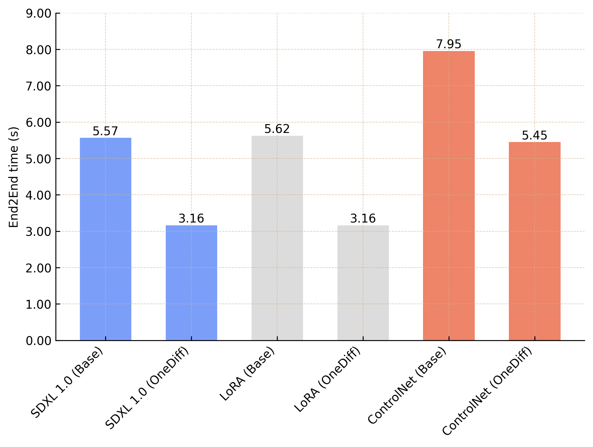
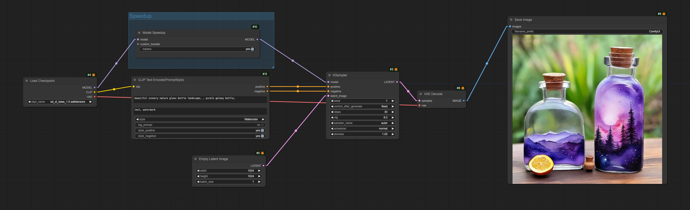
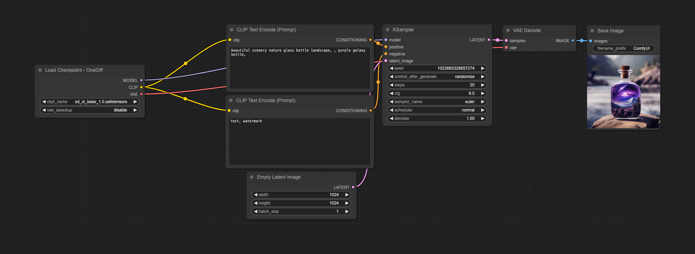

# OneDiff ComfyUI Nodes

<p align="center">

</p>

---

Performance of Community Edition

Updated on January 23, 2024. Device: RTX 3090


<div align="center">

  **SDXL End2End Time** , Image Size 1024x1024 , Batch Size 1 , steps 20

  <a href="https://github.com/siliconflow/onediff/tree/main" target="_blank">
  </a>
</div>


<details>
<summary> Figure Notes </summary>

- Workflow Download Links
- [SDXL 1.0 (Base)](https://github.com/siliconflow/onediff/releases/download/0.12.0/basic_base.png)
- [SDXL 1.0 (OneDiff)](https://github.com/siliconflow/onediff/releases/download/0.12.0/basic_onediff.png)
- [LoRA (Base)](https://github.com/siliconflow/onediff/releases/download/0.12.0/lora_base.png)
- [LoRA (OneDiff)](https://github.com/siliconflow/onediff/releases/download/0.12.0/lora_onediff.png)
- [ControlNet (Base)](https://github.com/siliconflow/onediff/releases/download/0.12.0/controlnet_base.png)
- [ControlNet (OneDiff)](https://github.com/siliconflow/onediff/releases/download/0.12.0/controlnet_onediff.png)


</details>

## Documentation

- [OneDiff ComfyUI Nodes](#onediff-comfyui-nodes)
  - [Documentation](#documentation)
    - [Installation Guide](#installation-guide)
    - [Basic Node Usage](#basic-node-usage)
      - [Model Speedup](#model-speedup)
      - [Load Checkpoint - OneDiff](#load-checkpoint---onediff)
    - [Compiler Cache](#compiler-cache)
    - [Quantization](#quantization)
  - [Tutorials](#tutorials)
  - [Contact](#contact)


### Installation Guide
This guide provides two methods to install ComfyUI and integrate it with the OneDiff library: via the Comfy CLI or directly from GitHub.

<details close>
<summary> Option 1: Installing via Comfy CLI </summary>

1. **Install Comfy CLI**:
   ```shell
   pip install comfy-cli
   ```

2. **Install ComfyUI**:
   ```shell
   comfy install
   ```

3. **Install OneDiff Comfy Nodes**:
   ```shell
   comfy node install onediff_comfy_nodes
   ```
   By default, this installs the oneflow backend. You can add other backends if needed; please refer to the OneDiff GitHub repository [here](https://github.com/siliconflow/onediff?tab=readme-ov-file#install-a-compiler-backend).

</details>

<details close>
<summary> Option 2: Installing via GitHub </summary>

First, install and set up [ComfyUI](https://github.com/comfyanonymous/ComfyUI), and then follow these steps:

1. **Clone OneDiff Repository**:
   ```shell
   git clone https://github.com/siliconflow/onediff.git
   ```

2. **Install OneDiff**:
   ```shell
   cd onediff && pip install -e .
   ```

3. **Integrate OneDiff Comfy Nodes with ComfyUI**:
   - **Symbolic Link (Recommended)**:
     ```shell
     ln -s $(pwd)/onediff_comfy_nodes path/to/ComfyUI/custom_nodes/
     ```
   - **Copy Directory**:
     ```shell
     cp -r onediff_comfy_nodes path/to/ComfyUI/custom_nodes/
     ```

4. **Install a Compiler Backend**

    For instructions on installing a compiler backend for OneDiff, please refer to the OneDiff GitHub repository [here](https://github.com/siliconflow/onediff?tab=readme-ov-file#install-a-compiler-backend).


</details>


### Basic Node Usage

**Note** All the images in this section can be loaded directly into ComfyUI. You can load them in ComfyUI to get the full workflow.

#### Model Speedup


#### Load Checkpoint - OneDiff

"Load Checkpoint - OneDiff" is the optimized version of "LoadCheckpoint", designed to accelerate the inference speed without any awareness required. It maintains the same input and output as the original node.



The "Load Checkpoint - OneDiff" node  set `vae_speedup` :  `enable` to enable VAE acceleration.


### Compiler Cache
**Avoid compilation time for online serving**

```shell
# Set custom directory for saving graphs in ComfyUI with OneFlow backend
export COMFYUI_ONEDIFF_SAVE_GRAPH_DIR="/path/to/save/graphs"

# Enable graph cache to avoid recompiling
export NEXFORT_GRAPH_CACHE=1

# Specify persistent cache directory for Torchinductor
export TORCHINDUCTOR_CACHE_DIR=~/.torchinductor_cache
```

### Quantization

**Note**: Quantization feature is only supported by **OneDiff Enterprise**.

OneDiff Enterprise offers a quantization method that reduces memory usage, increases speed, and maintains quality without any loss.

If you possess a OneDiff Enterprise license key, you can access instructions on OneDiff quantization and related models by visiting [Online Quantization for ComfyUI](./docs/ComfyUI_Online_Quantization.md). Alternatively, you can [contact](#contact) us to inquire about purchasing the OneDiff Enterprise license.


## Tutorials

- [Accelerate SD3 with onediff](./docs/sd3/README.md)
- [First Switch Lora](./docs/lora.md)
- [Accelerate cubiq/PuLID_ComfyUI](./docs/README.md)
- [Accelerate cubiq/ComfyUI_IPAdapter_plus](./docs/README.md)
- [Accelerate cubiq/ComfyUI_InstantID](./docs/README.md)
- [Accelerate ControlNet](./docs/ControlNet/README.md)
- [SVD](./docs/SVD/README.md)
- [DeepCache](./docs/lora_deepcache/README.md)

## Contact

For users of OneDiff Community, please visit [GitHub Issues](https://github.com/siliconflow/onediff/issues) for bug reports and feature requests.

For users of OneDiff Enterprise, you can contact contact@siliconflow.com for commercial support.

Feel free to join our [Discord](https://discord.gg/RKJTjZMcPQ) community for discussions and to receive the latest updates.
