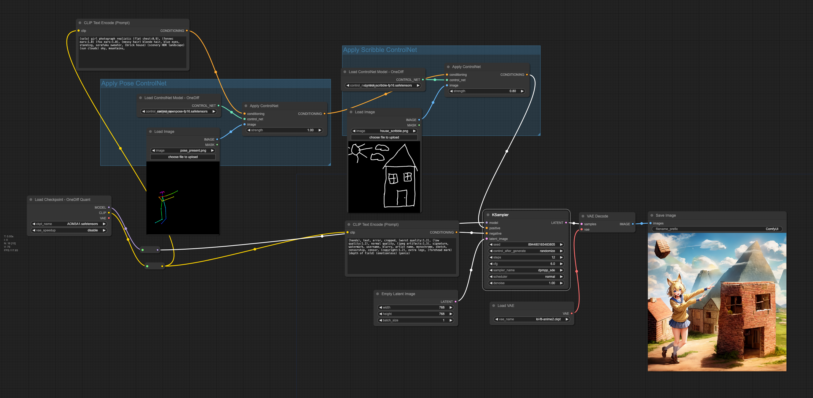

## 
ControlNet Documentation

### performance
- [**Installation Guide**](https://github.com/siliconflow/onediff/blob/main/README_ENTERPRISE.md#install-onediff-enterprise)
- **Checkpoint:** v1-5-pruned-emaonly.ckpt
- **ControlNet:** control_openpose-fp16.safetensors
- **(4.48 - 2.35) / 4.48 = 47.6%**

  **End2End Time** , Image Size 512x512 , Batch Size 4 , steps 20

  

Figure Notes

- [ControlNet Baseline Workflow](https://github.com/siliconflow/onediff/releases/download/0.12.0/controlnet_torch_00.png)
- [ControlNet + OneDiff Enterprise Workflow](https://github.com/siliconflow/onediff/releases/download/0.12.0/controlnet_onediff_quant_02.png)

###  ControlNet Workflow
Here's some simple example of how to use controlnets. You can load this image in `ComfyUI` to get the full workflow.

**Please note**: When launching comfyui, add the `gpu-only` parameter, for example, `python main.py --gpu-only`.
#### Basic Usage
Replace `"Load ControlNet Model"` with `"Load ControlNet Model - OneDiff"` in comfyui, as follows:

#### Quantization

#### Mixing ControlNet

## FAQ
- Q: RuntimeError: After graph built, the device of graph can't be modified, current device: cuda:0, target device: cpu
  - Please use `--gpu-only` when launching comfyui, for example, `python main.py --gpu-only`.

- Q: oneflow._oneflow_internal.exception.Exception: Check failed:(xxx == yyy)
   - To initiate a fresh run, delete the files within the `ComfyUI/input/graphs/` directory and then proceed with rerunning the process.
   - **Switching the strength parameter between 0 and > 0 in the "Apply ControlNet" node is not supported.** A strength of 0 implies not using ControlNet, while a strength greater than 0 activates ControlNet. This may lead to changes in the graph structure, resulting in errors.

- Q: Acceleration of ControlNet: Not very apparent
   - ControlNet is a very small model, In prior tests, the iteration ratio between UNet and ControlNet was 2:1.
   - UNet compilation contributed to a 30% acceleration, while ControlNet contributed 15%, resulting in an overall acceleration of approximately 45%.
   - In the enterprise edition, UNet exhibited a more substantial acceleration, making the acceleration from ControlNet relatively smaller.

## Contact

For users of OneDiff Community, please visit [GitHub Issues](https://github.com/siliconflow/onediff/issues) for bug reports and feature requests.

For users of OneDiff Enterprise, you can contact contact@siliconflow.com for commercial support.

Feel free to join our [Discord](https://discord.gg/RKJTjZMcPQ) community for discussions and to receive the latest updates.
