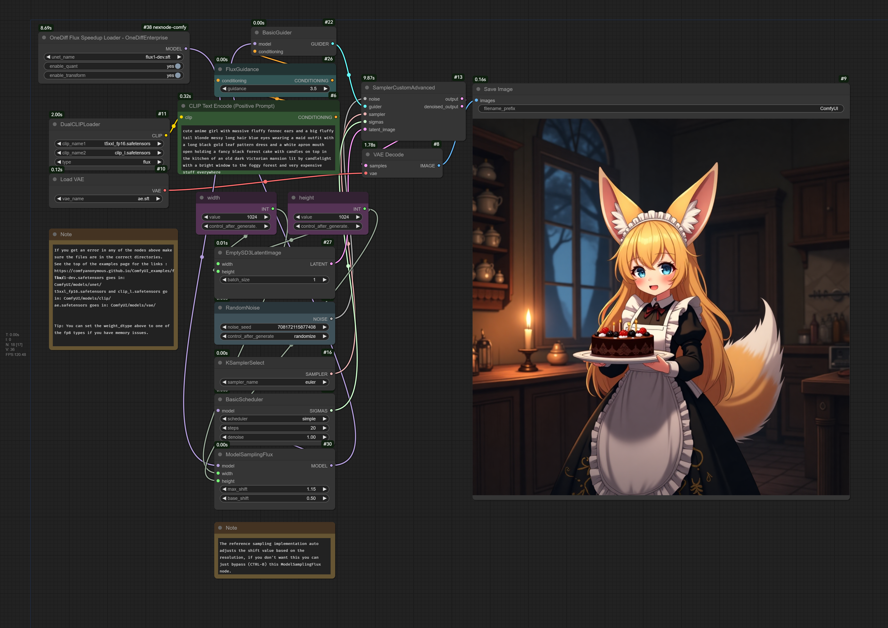

## Accelerate FLUX by using onediff
huggingface: https://huggingface.co/black-forest-labs/FLUX.1-dev

## Environment setup
### Set UP requirements
```shell
# python 3.10
COMFYUI_DIR=$pwd/ComfyUI
# install ComfyUI
git clone https://github.com/comfyanonymous/ComfyUI.git

# install onediff & onediff_comfy_nodes
git clone https://github.com/siliconflow/onediff.git
cd onediff && pip install -r onediff_comfy_nodes/FLUX/requirements.txt && pip install -e .
ln -s $pwd/onediff/onediff_comfy_nodes  $COMFYUI_DIR/custom_nodes
```


### Download relevant models

- step1: Get User Access Tokens here https://huggingface.co/settings/tokens

- step2: Download relevant models
```shell
export ACCESS_TOKEN="User Access Tokens"
wget --header="Authorization: Bearer $ACCESS_TOKEN" \
https://huggingface.co/black-forest-labs/FLUX.1-dev/resolve/main/flux1-dev.safetensors -O models/checkpoints/flux1-dev.safetensors

wget --header="Authorization: Bearer $ACCESS_TOKEN" \
https://huggingface.co/stabilityai/stable-diffusion-3-medium/resolve/main/text_encoders/clip_l.safetensors -O models/clip/clip_l.safetensors

# wget --header="Authorization: Bearer $ACCESS_TOKEN" \
# https://huggingface.co/stabilityai/stable-diffusion-3-medium/resolve/main/text_encoders/t5xxl_fp16.safetensors -O models/clip/t5xxl_fp16.safetensors

wget --header="Authorization: Bearer $ACCESS_TOKEN" \
https://huggingface.co/stabilityai/stable-diffusion-3-medium/resolve/main/text_encoders/t5xxl_fp8_e4m3fn.safetensors -O models/clip/t5xxl_fp8_e4m3fn.safetensors
```


## Usage Example
### Run ComfyUI
```shell
cd $COMFYUI_DIR && python main.py --gpu-only --disable-cuda-malloc
```

### WorkFlow
Here is a very basic example how to use it:
[workflow_flux_speedup.json](../../benchmarks/resources/workflows/nexfort/flux_speedup.json)



## Performance Comparison

- Testing on NVIDIA GeForce RTX 4090, with image size of 1024*1024, iterating 20 steps.


| Metric                                           | NVIDIA GeForce RTX 4090 (1024 * 1024) |
| ------------------------------------------------ | ------------------------------------- |
| Data update date(yyyy-mm-dd)                     | 2024-11-19                            |
| PyTorch E2E time                                 | 12.44 s                               |
| OneDiff E2E time                                 | 7.12 s (-42%)                         |
| PyTorch Max Mem Used                             | 20.510 GiB                            |
| OneDiff Max Mem Used                             | 23.094 GiB                            |
| PyTorch Warmup with Run time                     | 49.09 s                               |
| OneDiff Warmup with Compilation time<sup>1</sup> | 113.73 s                              |
| OneDiff Warmup with Cache time                   | 20.27 s                               |

 <sup>1</sup> OneDiff Warmup with Compilation time is tested on  AMD EPYC 7543 32-Core Processor CPU. Note this is just for reference, and it varies a lot on different CPU.


## Quality

The following table shows the comparison of the plot, seed=0, Baseline (non optimized) on the left, and OneDiff (optimized) on the right
