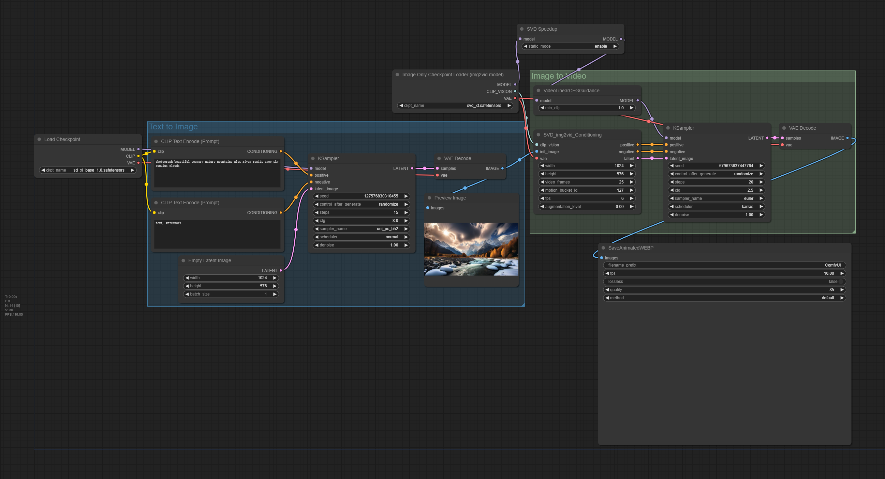

## SVD Workflow

<details>
<summary> Download the required model files </summary>

1. Download the [`sd_xl_base_1.0.safetensors`](https://huggingface.co/stabilityai/stable-diffusion-xl-base-1.0/resolve/main/sd_xl_base_1.0.safetensors) file and place it in the `ComfyUI/models/checkpoints/` directory:


```bash
wget https://huggingface.co/stabilityai/stable-diffusion-xl-base-1.0/resolve/main/sd_xl_base_1.0.safetensors -O ComfyUI/models/checkpoints/sd_xl_base_1.0.safetensors
```

2. Download the [`svd_xt.safetensors`](https://huggingface.co/stabilityai/stable-video-diffusion-img2vid-xt/resolve/main/svd_xt.safetensors) or [`svd_xt_1_1.safetensors`](https://huggingface.co/stabilityai/stable-video-diffusion-img2vid-xt-1-1/blob/main/svd_xt_1_1.safetensors) file and place it in the `ComfyUI/models/checkpoints/` directory:

```bash
wget https://huggingface.co/stabilityai/stable-video-diffusion-img2vid-xt/resolve/main/svd_xt.safetensors -O ComfyUI/models/checkpoints/svd_xt.safetensors
```

</details>





## Environment
Only supported on the Linux platform.

Test(Updated on March 1st, 2023)
- Python 3.10.13
- NVIDIA A800-SXM4-80GB
- ComfyUI Thu Feb 29 commit: cb7c3a2921cfc0805be0229b4634e1143d60e6fe

## Contact

For users of OneDiff Community, please visit [GitHub Issues](https://github.com/siliconflow/onediff/issues) for bug reports and feature requests.

For users of OneDiff Enterprise, you can contact contact@siliconflow.com for commercial support.

Feel free to join our [Discord](https://discord.gg/RKJTjZMcPQ) community for discussions and to receive the latest updates.
