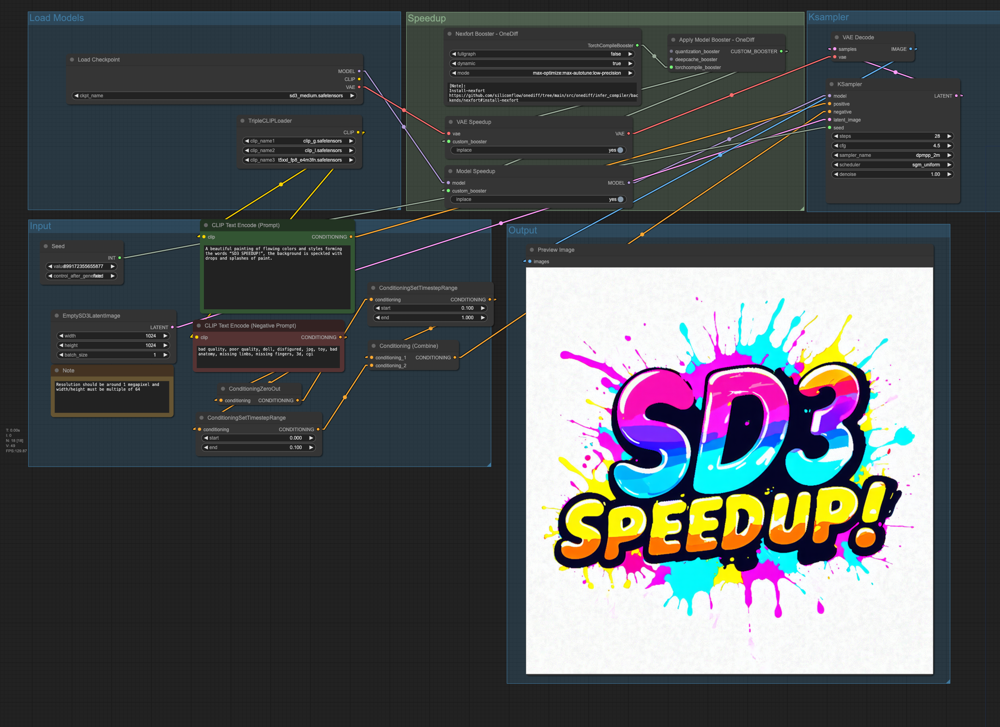

## Accelerate SD3 by using onediff
huggingface: https://huggingface.co/stabilityai/stable-diffusion-3-medium

## Environment setup
### Set UP requirements
```shell
# python 3.10
COMFYUI_DIR=$pwd/ComfyUI
# install ComfyUI
git clone https://github.com/comfyanonymous/ComfyUI.git

# install onediff & onediff_comfy_nodes
git clone https://github.com/siliconflow/onediff.git
cd onediff && pip install -r onediff_comfy_nodes/sd3/requirements.txt && pip install -e .
ln -s $pwd/onediff/onediff_comfy_nodes  $COMFYUI_DIR/custom_nodes
```

<details close>
<summary> test_install.py </summary>

```python
# Compile arbitrary models (torch.nn.Module)
import torch
from onediff.utils.import_utils import is_nexfort_available
assert is_nexfort_available() == True

import onediff.infer_compiler as infer_compiler

class MyModule(torch.nn.Module):
    def __init__(self):
        super().__init__()
        self.lin = torch.nn.Linear(100, 10)

    def forward(self, x):
        return torch.nn.functional.relu(self.lin(x))

mod = MyModule().to("cuda").half()
with torch.inference_mode():
    compiled_mod = infer_compiler.compile(mod,
        backend="nexfort",
        options={"mode": "max-autotune:cudagraphs", "dynamic": True, "fullgraph": True},
    )
    print(compiled_mod(torch.randn(10, 100, device="cuda").half()).shape)

print("Successfully installed～")
```

</details>

### Download relevant models

- step1: Get User Access Tokens here https://huggingface.co/settings/tokens

- step2: Download relevant models
```shell
export ACCESS_TOKEN="User Access Tokens"
wget --header="Authorization: Bearer $ACCESS_TOKEN" \
https://huggingface.co/stabilityai/stable-diffusion-3-medium/resolve/main/sd3_medium.safetensors -O models/checkpoints/sd3_medium.safetensors

wget --header="Authorization: Bearer $ACCESS_TOKEN" \
https://huggingface.co/stabilityai/stable-diffusion-3-medium/resolve/main/text_encoders/clip_g.safetensors -O models/clip/clip_g.safetensors

wget --header="Authorization: Bearer $ACCESS_TOKEN" \
https://huggingface.co/stabilityai/stable-diffusion-3-medium/resolve/main/text_encoders/clip_l.safetensors -O models/clip/clip_l.safetensors

# wget --header="Authorization: Bearer $ACCESS_TOKEN" \
# https://huggingface.co/stabilityai/stable-diffusion-3-medium/resolve/main/text_encoders/t5xxl_fp16.safetensors -O models/clip/t5xxl_fp16.safetensors

wget --header="Authorization: Bearer $ACCESS_TOKEN" \
https://huggingface.co/stabilityai/stable-diffusion-3-medium/resolve/main/text_encoders/t5xxl_fp8_e4m3fn.safetensors -O models/clip/t5xxl_fp8_e4m3fn.safetensors
```


## Usage Example
### Run ComfyUI
```shell
# https://github.com/huggingface/transformers/issues/5486
export TOKENIZERS_PARALLELISM=false

# For graph cache to to avoid recompiling
export NEXFORT_GRAPH_CACHE=1
# For persistent cache dir
export TORCHINDUCTOR_CACHE_DIR=~/.torchinductor_cache
cd $COMFYUI_DIR && python main.py --gpu-only --disable-cuda-malloc
```

### WorkFlow
Here is a very basic example how to use it:
[workflow_sd3_speedup.json](../../benchmarks/resources/workflows/nexfort/sd3_basic.json)



## Performance Comparison

- Testing on NVIDIA GeForce RTX 4090, with image size of 1024*1024, iterating 28 steps.
- OneDiff[Nexfort] Compile mode:
`max-optimize:max-autotune:low-precision`


| Metric                                           | NVIDIA GeForce RTX 4090 (1024 * 1024) |
| ------------------------------------------------ | ------------------------------------- |
| Data update date(yyyy-mm-dd)                     | 2024-06-19                            |
| PyTorch E2E time                                 | 4.27 s                                |
| OneDiff E2E time                                 | 2.87 s(-32%)                          |
| PyTorch Max Mem Used                             | 18.445GiB                             |
| OneDiff Max Mem Used                             | 19.199GiB                             |
| PyTorch Warmup with Run time                     | 10s                                   |
| OneDiff Warmup with Compilation time<sup>1</sup> | 423s                                  |
| OneDiff Warmup with Cache time                   | 79s                                   |

 <sup>1</sup> OneDiff Warmup with Compilation time is tested on  AMD EPYC 7543 32-Core Processor CPU. Note this is just for reference, and it varies a lot on different CPU.


## Dynamic shape for SD3.

**Q: How to use different resolutions in a production environment?**

A: Warmup: Perform inference at different resolutions before deployment to ensure stability and performance;


**Q: Why is warmup necessary when switching resolutions?**

A: Warmup is necessary because NVIDIA AUTO TUNE automatically optimizes GPU settings during this process to enhance system efficiency when switching resolutions.


## Quality

The following table shows the comparison of the plot, seed=1, Baseline (non optimized) on the left, and OneDiff (optimized) on the right

|                                                                                                                      |                                                                                                                     |
| -------------------------------------------------------------------------------------------------------------------- | ------------------------------------------------------------------------------------------------------------------- |
|  |  |
