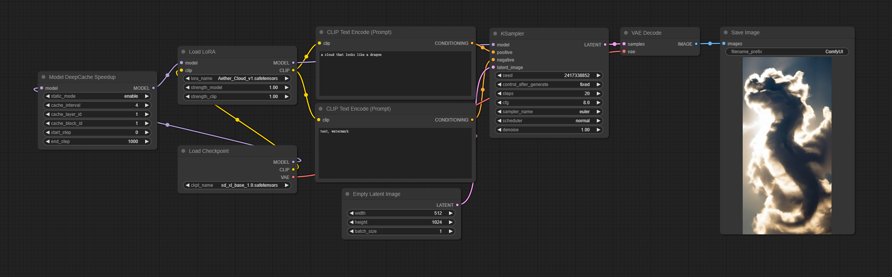
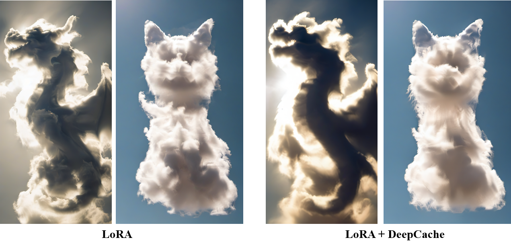

## LoRA to Combine with DeepCache for Acceleration

We combined [OneDiff DeepCache](https://github.com/siliconflow/onediff/tree/main/onediff_comfy_nodes#deepcache) and LoRA, achieving more than a 2.7x acceleration for shapes of 1024*1024, workflow reference:

For the Aether Cloud style of LoRA, it can be downloaded from https://civitai.com/models/141029/aether-cloud-lora-for-sdxl.

#### Performance of Community Edition:

Updated on Jan 11, 2024. Device: A100 GPU

|                                      | LoRA | LoRA + DeepCache | Percentage improvement |
| -------------------------------------------------------------- | --------------- | ------------------ | ---------------------- |
| 512 * 1024 | 16.30 it/s        | 39.57 it/s           | 142.45%                 |
| 1024 * 1024              | 9.10 it/s        | 25.19 it/s           | 176.04%                 |

However, due to the characteristics of DeepCache, combining it with LoRA introduces some differences in the output:

Note: If your system or business requires more personalized support, please check: https://github.com/siliconflow/onediff?tab=readme-ov-file#onediff-enterprise-edition
