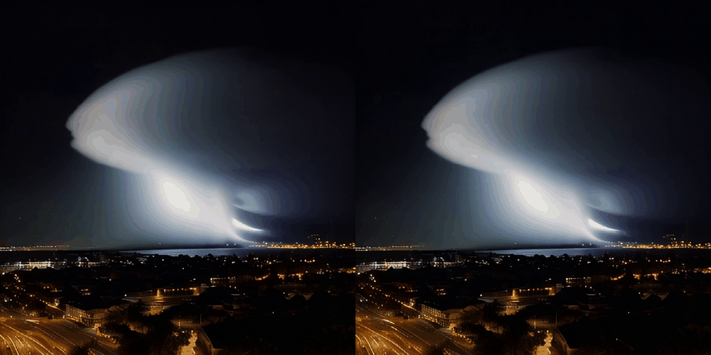

# Run Latte with nexfort backend(Beta Release)


1. [Environment Setup](#environment-setup)
   - [Set up Latte](#set-up-latte)
   - [Set up nexfort backend](#set-up-nexfort-backend)
   - [Set up onediff](#set-up-onediff)
2. [Run](#run)
   - [Run without compile](#run-without-compile)
   - [Run with compile](#run-with-compile)
3. [Performance Comparison](#performance-comparison)
4. [Quality](#quality)

## Environment setup
### Set up Latte
HF model: https://huggingface.co/maxin-cn/Latte-1
```bash
git clone -b run https://github.com/siliconflow/dit_latte/
cd dit_latte
export PYTHONPATH=`pwd`:$PYTHONPATH
```

### Set up nexfort backend
https://github.com/siliconflow/onediff/tree/main/src/onediff/infer_compiler/backends/nexfort

### Set up onediff
https://github.com/siliconflow/onediff?tab=readme-ov-file#installation

## Run
model_id_or_path_to_latte is the model id or model path of latte, such as `maxin-cn/Latte-1` or `/data/hf_models/Latte-1/`

### Go to the onediff folder
```
cd onediff
```

### Run without compile(the original pytorch HF diffusers pipeline)
```
python3 ./benchmarks/text_to_video_latte.py \
--model maxin-cn/Latte-1 \
--steps 50 \
--compiler none \
--output-video ./latte.mp4 \
--prompt "An epic tornado attacking above aglowing city at night."
```

### Run with compile
```
python3 ./benchmarks/text_to_video_latte.py \
--model maxin-cn/Latte-1 \
--steps 50 \
--compiler nexfort \
--output-video ./latte_compile.mp4 \
--prompt "An epic tornado attacking above aglowing city at night."
```

## Performance Comparison

### Metric

#### On A100
| Metric                                           | NVIDIA A100-PCIE-40GB (512 * 512) |
| ------------------------------------------------ | --------------------------------- |
| Data update date(yyyy-mm-dd)                     | 2024-06-19                        |
| PyTorch iteration speed                          | 1.60 it/s                         |
| OneDiff iteration speed                          | 2.27 it/s(+41.9%)                 |
| PyTorch E2E time                                 | 32.618 s                          |
| OneDiff E2E time                                 | 22.601 s(-30.7%)                  |
| PyTorch Max Mem Used                             | 19.9 GiB                          |
| OneDiff Max Mem Used                             | 19.9 GiB                          |
| PyTorch Warmup with Run time                     | 33.291 s                          |
| OneDiff Warmup with Compilation time<sup>1</sup> | 572.877 s                         |
| OneDiff Warmup with Cache time                   | 148.068 s                         |

 <sup>1</sup> OneDiff Warmup with Compilation time is tested on Intel(R) Xeon(R) Gold 6348 CPU @ 2.60GHz. Note this is just for reference, and it varies a lot on different CPU.

#### nexfort compile config and warmup cost
- compiler-config
  - setting `--compiler-config '{"mode": "max-optimize:max-autotune:freezing:benchmark:low-precision", "memory_format": "channels_last", "options": {"inductor.optimize_linear_epilogue": false, "triton.fuse_attention_allow_fp16_reduction": false}}` will help to make the best performance but the compilation time is about 572 seconds
  - setting `--compiler-config '{"mode": "max-autotune", "memory_format": "channels_last", "options": {"inductor.optimize_linear_epilogue": false, "triton.fuse_attention_allow_fp16_reduction": false}}` will reduce compilation time to about 236 seconds and just slightly reduce the performance
- fuse_qkv_projections: True

## Quality

When using nexfort as the backend for onediff compilation acceleration (right video), the generated video are lossless.

<p align="center">

</p>
