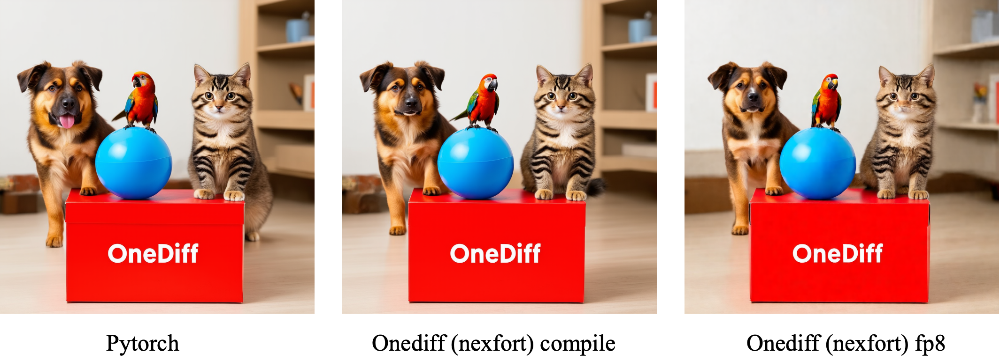

# Run SD3 with nexfort backend (Beta Release)

1. [Environment Setup](#environment-setup)
   - [Set Up OneDiff](#set-up-onediff)
   - [Set Up NexFort Backend](#set-up-nexfort-backend)
   - [Set Up Diffusers](#set-up-diffusers)
   - [Download SD3 Model for Diffusers](#download-sd3-model-for-diffusers)
2. [Execution Instructions](#execution-instructions)
   - [Run Without Compilation (Baseline)](#run-without-compilation-baseline)
   - [Run With Compilation](#run-with-compilation)
3. [Performance Comparison](#performance-comparison)
4. [Dynamic Shape for SD3](#dynamic-shape-for-sd3)
5. [Quantization](#quantization)
6. [Quality](#quality)

## Environment setup
### Set up onediff
https://github.com/siliconflow/onediff?tab=readme-ov-file#installation

### Set up nexfort backend
https://github.com/siliconflow/onediff/tree/main/src/onediff/infer_compiler/backends/nexfort

### Set up diffusers

```
# Ensure diffusers include the SD3 pipeline.
pip3 install --upgrade diffusers[torch]
```
### Download SD3 model for diffusers
Model version for diffusers: https://huggingface.co/stabilityai/stable-diffusion-3-medium-diffusers

HF pipeline: https://github.com/huggingface/diffusers/blob/main/docs/source/en/api/pipelines/stable_diffusion/stable_diffusion_3.md

## Execution instructions

### Run 1024*1024 without compile (the original pytorch HF diffusers baseline)
```
python3 onediff_diffusers_extensions/examples/sd3/text_to_image_sd3.py \
    --saved-image sd3.png
```

### Run 1024*1024 with torch compile
```
python3 onediff_diffusers_extensions/examples/sd3/text_to_image_sd3.py \
    --use_torch_compile 1 \
    --warmup-iterations 3 \
    --saved-image sd3_torch_cpmpile.png
```

### Run 1024*1024 with onediff (nexfort) compile

```
python3 onediff_diffusers_extensions/examples/sd3/text_to_image_sd3.py \
    --compiler-config '{"mode": "max-optimize:max-autotune:low-precision:cudagraphs:cache-all:freezing:benchmark", "memory_format": "channels_last"}' \
    --saved-image sd3_compile.png
```

## Performance comparation

Testing on H800-NVL-80GB with torch 2.3.0, with image size of 1024*1024, iterating 28 steps:
| Metric                                           |                                     |
| ------------------------------------------------ | ----------------------------------- |
| Data update date(yyyy-mm-dd)                     | 2024-06-25                          |
| PyTorch iteration speed                          | 15.11 it/s                          |
| OneDiff iteration speed                          | 25.14 it/s (+66.4%)                 |
| PyTorch E2E time                                 | 2.03 s                              |
| OneDiff E2E time                                 | 1.21 s (-40.1%)                     |
| PyTorch Max Mem Used                             | 18.788 GiB                          |
| OneDiff Max Mem Used                             | 17.926 GiB                          |
| PyTorch Warmup with Run time                     | 2.86 s                              |
| OneDiff Warmup with Compilation time<sup>1</sup> | 889.25 s                            |
| OneDiff Warmup with Cache time                   | 44.38 s                             |

<sup>1</sup> OneDiff Warmup with Compilation time is tested on Intel(R) Xeon(R) Platinum 8468. Note this is just for reference, and it varies a lot on different CPU.


Testing on 4090:
| Metric                                           |                                     |
| ------------------------------------------------ | ----------------------------------- |
| Data update date(yyyy-mm-dd)                     | 2024-06-24                          |
| PyTorch iteration speed                          | 6.67 it/s                           |
| OneDiff iteration speed                          | 12.24 it/s (+83.3%)                 |
| PyTorch E2E time                                 | 4.90 s                              |
| OneDiff E2E time                                 | 2.48 s (-49.4%)                     |
| PyTorch Max Mem Used                             | 18.799 GiB                          |
| OneDiff Max Mem Used                             | 17.902 GiB                          |
| PyTorch Warmup with Run time                     | 4.99 s                              |
| OneDiff Warmup with Compilation time<sup>2</sup> | 302.79 s                            |
| OneDiff Warmup with Cache time                   | 51.96 s                             |

 <sup>2</sup> AMD EPYC 7543 32-Core Processor


## Dynamic shape for SD3.

Run:

```
# The best practice mode configuration for dynamic shape is `max-optimize:max-autotune:low-precision`.
python3 onediff_diffusers_extensions/examples/sd3/text_to_image_sd3.py \
    --compiler-config '{"mode": "max-optimize:max-autotune:low-precision", "memory_format": "channels_last", "dynamic": true}' \
    --height 512 \
    --width 768 \
    --run_multiple_resolutions 1 \
    --saved-image sd3_compile.png
```
## Quantization

> [!NOTE]
Quantization is a feature for onediff enterprise.

### Run

Quantization of the model's layers can be selectively performed based on precision. Download `fp8_e4m3.json` or `fp8_e4m3_per_tensor.json` from https://huggingface.co/siliconflow/stable-diffusion-3-onediff-nexfort-fp8.

The --arg `quant-submodules-config-path` is optional. If left `None`, it will quantize all linear layers.

```
# Applies dynamic symmetric per-tensor activation and per-tensor weight quantization to all linear layers. Both activations and weights are quantized to e4m3 format.
python3 onediff_diffusers_extensions/examples/sd3/text_to_image_sd3.py \
    --compiler-config '{"mode": "quant:max-optimize:max-autotune:low-precision:cudagraphs:freezing:benchmark", "memory_format": "channels_last"}' \
    --quantize-config '{"quant_type": "fp8_e4m3_e4m3_dynamic_per_tensor"}' \
    --quant-submodules-config-path /path/to/fp8_e4m3_per_tensor.json \
    --saved-image sd3_fp8.png
```
or
```
# Applies dynamic symmetric per-token activation and per-channel weight quantization to all linear layers.
python3 onediff_diffusers_extensions/examples/sd3/text_to_image_sd3.py \
    --compiler-config '{"mode": "quant:max-optimize:max-autotune:low-precision:cudagraphs:freezing:benchmark", "memory_format": "channels_last"}' \
    --quantize-config '{"quant_type": "fp8_e4m3_e4m3_dynamic"}' \
    --quant-submodules-config-path /path/to/fp8_e4m3.json \
    --saved-image sd3_fp8.png
```

### Metric

The performance of above quantization types on the H800-NVL-80GB is as follows:

| quant_type                       | E2E Inference Time | Iteration speed    | Max Used CUDA Memory |
|----------------------------------|--------------------|--------------------|----------------------|
| fp8_e4m3_e4m3_dynamic_per_tensor | 1.15 s (-43.4%)    | 26.30 it/s (+74.1%)| 16.933 GiB           |
| fp8_e4m3_e4m3_dynamic            | 1.09 s (-46.3%)    | 27.75 it/s (+83.7%)| 17.098 GiB           |

## Quality
When using nexfort as the backend for onediff compilation acceleration, the generated images are almost lossless.

<p align="center">

</p>
