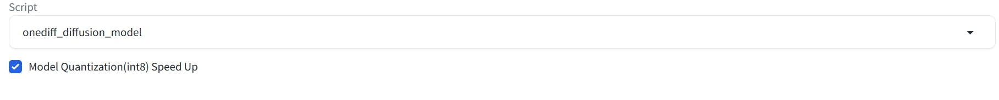

# OneDiff Stable-Diffusion-WebUI Extensions

- [Performance of Community Edition](#performance-of-community-edition)
- [Installation Guide](#installation-guide)
- [Extensions Usage](#extensions-usage)
    - [Fast Model Switching](#fast-model-switching)
    - [LoRA](#lora)
- [Quantization](#quantization)
- [Contact](#contact)

## Performance of Community Edition

Updated on JAN 13, 2024. Device: RTX 3090. Resolution: 1024x1024
|               | torch(Baseline) | TensorRT-v9.0.1 | onediff(Optimized) | Percentage improvement |
| ------------- | --------------- | --------------- | ------------------ | ---------------------- |
| SDXL w/o LoRA | 2.99it/s        | 6.40it/s        | 7.08it/s           | 236.79%                |
| SDXL w/  LoRA | 2.95it/s        | N/A             | 7.08it/s           | 240.00%                |

End2end time(seconds) to generate a 1024x1024 image with SDXL (30 steps) on NVIDIA RTX 3090:
|               | torch(Baseline) | TensorRT-v9.0.1 | onediff(Optimized) | Percentage improvement |
| ------------- | --------------- | --------------- | ------------------ | ---------------------- |
| SDXL w/o LoRA | 11.03           | 5.55            | 5.16               | 213.76%                |
| SDXL w/  LoRA | 11.17           | N/A             | 5.20               | 214.81%                |

Note: The performence with LoRA doesn't include the time of LoRA fusing. And the "slowing down" of the model inference speed with LoRA falls within the normal fluctuation range.


## Installation Guide

It is recommended to create a Python virtual environment in advance. For example `conda create -n sd-webui python=3.10`.

Run the commands below to install Sable Diffusion WebUI and OneDiff extensions.

```bash
git clone https://github.com/AUTOMATIC1111/stable-diffusion-webui.git
git clone https://github.com/siliconflow/onediff.git
ln -s "$(pwd)/onediff/onediff_sd_webui_extensions" "$(pwd)/stable-diffusion-webui/extensions/onediff_sd_webui_extensions"
cd stable-diffusion-webui

# Install all of stable-diffusion-webui's dependencies.
venv_dir=- bash webui.sh --port=8080

# Exit webui server and upgrade some of the components that conflict with onediff.
cd repositories/generative-models && git checkout 9d759324 && cd -
pip install -U einops==0.7.0
```

## Run stable-diffusion-webui service

```bash
cd stable-diffusion-webui
python webui.py --port 8080
```

Accessing http://server:8080/ from a web browser.

## Extensions Usage

To activate OneDiff extension acceleration, follow these steps: 
Select `onediff_diffusion_model` from the Script menu, enter a prompt in the text box (e.g., "a black dog"), and then click the "Generate" button.


### Fast Model Switching

When switching models, if the new model has the same structure as the old model, OneDiff will reuse the previously compiled graph, which means you don't need to compile the new model again, which significantly reduces the time it takes you to switch models.

> Note: Please make sure that your PyTorch version is at least 2.1.0. And the feature is not supported for quantized model.

### LoRA

OneDiff supports the complete functionality related to LoRA. You can use OneDiff-based LoRA just like the native LoRA in sd-webui.

FAQ:

1. After switching LoRA, should I recompile the model?

    OneDiff supports dynamically switching LoRA without  recompiling the model, because the model with LoRA and the one without LoRA share the same parameter pointer, which have already been captured by the static graph.

2. What's the time cost of LoRA fusing?

    The initial few times of LoRA fusing may take a bit of time (1~2s), but when stabilized, the time cost is ~700ms.

3. Will LoRA fusing affect the inference efficiency of the model?

    No, the model's inference efficiency remains the same after fusing LoRA as it was before fusing LoRA.

## Quantization

**Note**: Quantization feature is only supported by **OneDiff Enterprise**.

OneDiff Enterprise offers a quantization method that reduces memory usage, increases speed, and maintains quality without any loss.

You can use the quantization feature by simply checking the *Model Quantization (int8) Speed Up* option which enables better inference performence as the image below.



If you possess a OneDiff Enterprise license key, you can access instructions on OneDiff quantization and related models by visiting [Hugginface/siliconflow](https://huggingface.co/siliconflow). Alternatively, you can [contact](#contact) us to inquire about purchasing the OneDiff Enterprise license.

Note: The quantified model doesn't currently support LoRA loading, and related features are under emergency development.

## Use OneDiff by API

Run the commands below to use Sable Diffusion WebUI with OneDiff extensions (Assume you are in the `stable-diffusion-webui/` dir).

```
# start sd-webui client
python3 webui.py --api

# send request
python3 extensions/onediff_sd_webui_extensions/api_examples/txt2img.py
python3 extensions/onediff_sd_webui_extensions/api_examples/img2img.py
```

Then you can get the images returned by sd-webui client at `./api_out/txt2img/` and `./api_out/img2img/`.

To use the OneDiff-based sd-webui API, you only need to add a `"script": "onediff_diffusion_model"` field to the request to speed up model inference.

For OneDiff Enterprise, add `"script_args" : [{"0": True}]` to use the quantization feature.

Check file [txt2img.py](./api_examples/txt2img.py) and [img2img.py](./api_examples/img2img.py) for more details.

## Contact

For users of OneDiff Community, please visit [GitHub Issues](https://github.com/siliconflow/onediff/issues) for bug reports and feature requests.

For users of OneDiff Enterprise, you can contact contact@siliconflow.com for commercial support.

Feel free to join our [Discord](https://discord.gg/RKJTjZMcPQ) community for discussions and to receive the latest updates.
