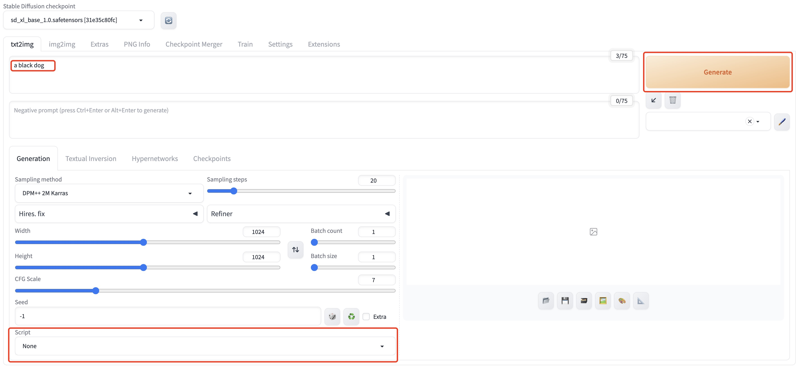
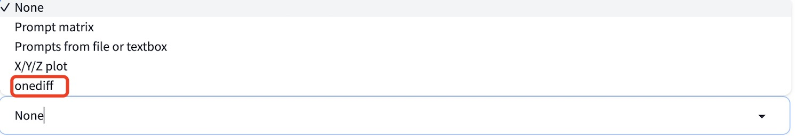

# Stable-Diffusion-WebUI-OneDiff

- [Performance of Community Edition](#performance-of-community-edition)
- [Installation Guide](#installation-guide)
- [Extensions Usage](#extensions-usage)

## Performance of Community Edition

Updated on JAN 13, 2024. Device: RTX 3090. Resolution: 1024x1024
|               | torch(Baseline) | TensorRT-v9.0.1 | onediff(Optimized) | Percentage improvement |
| ------------- | --------------- | --------------- | ------------------ | ---------------------- |
| SDXL w/o LoRA | 2.99it/s        | 6.40it/s        | 7.10it/s           | 237.46%                |
| SDXL w/  LoRA | 2.95it/s        | N/A             | 7.09it/s           | 240.34%                |

End2end time(seconds) to generate a 1024x1024 image with SDXL (30 steps) on NVIDIA RTX 3090:
|               | torch(Baseline) | TensorRT-v9.0.1 | onediff(Optimized) | Percentage improvement |
| ------------- | --------------- | --------------- | ------------------ | ---------------------- |
| SDXL w/o LoRA | 11.03           | 5.55            | 5.20               | 212.16%                |
| SDXL w/  LoRA | 11.20           | N/A             | 5.30               | 211.32%                |

Note: The performence with LoRA doesn't include the time of LoRA fusing. And the "slowing down" of the model inference speed with LoRA falls within the normal fluctuation range.


## Installation Guide

It is recommended to create a Python virtual environment in advance. For example `conda create -n sd-webui python=3.10`.

```bash
git clone https://github.com/AUTOMATIC1111/stable-diffusion-webui.git
git clone https://github.com/siliconflow/onediff.git
cp -r onediff/onediff_sd_webui_extensions stable-diffusion-webui/extensions/
cd stable-diffusion-webui && git checkout 4afaaf8  # The tested git commit id is 4afaaf8.

# Install all of stable-diffusion-webui's dependencies.
venv_dir=- bash webui.sh --port=8080

# Exit webui server and upgrade some of the components that conflict with onediff.
cd repositories/generative-models && git checkout 9d759324 && cd -
pip install -U einops==0.7.0
```

## Run stable-diffusion-webui service

```bash
cd stable-diffusion-webui
python webui.py --port 8080
```

Accessing http://server:8080/ from a web browser.

## Extensions Usage

Type prompt in the text box, such as `a black dog`. Click the `Generate` button in the upper right corner to generate the image. As you can see in the image below:



To enable OneDiff extension acceleration, select `onediff_diffusion_model` in Script and click the `Generate` button.



## LoRA

OneDiff supports the complete functionality related to LoRA. You can use OneDiff-based LoRA just like the native LoRA in sd-webui.

FAQ:


1. Does OneDiff support model types other than LoRA, such as LyCORIS?

    If your LoRA model only contains the weights of the Linear module, you can directly use OneDiff without any modifications. But if your LoRA model includes the weights of the Conv module (such as LyCORIS), you need to disable constant folding optimization by setting the env var `ONEFLOW_MLIR_ENABLE_INFERENCE_OPTIMIZATION` to 0 (which may cause a performance drop of around 4.4%), otherwise the weights of the Conv module may not be loaded into the model.

2. After switching LoRA, should I recompile the model?

    OneDiff supports dynamically switching LoRA without  recompiling the model, because the model with LoRA and the one without LoRA share the same parameter pointer, which have already been captured by the static graph.

3. What's the time cost of LoRA fusing?

    The initial few times of LoRA fusing may take a bit of time (1~2s), but when stabilized, the time cost is ~700ms.

4. Will LoRA fusing affect the inference efficiency of the model?

    No, the model's inference efficiency remains the same after fusing LoRA as it was before fusing LoRA.
